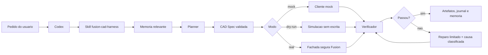
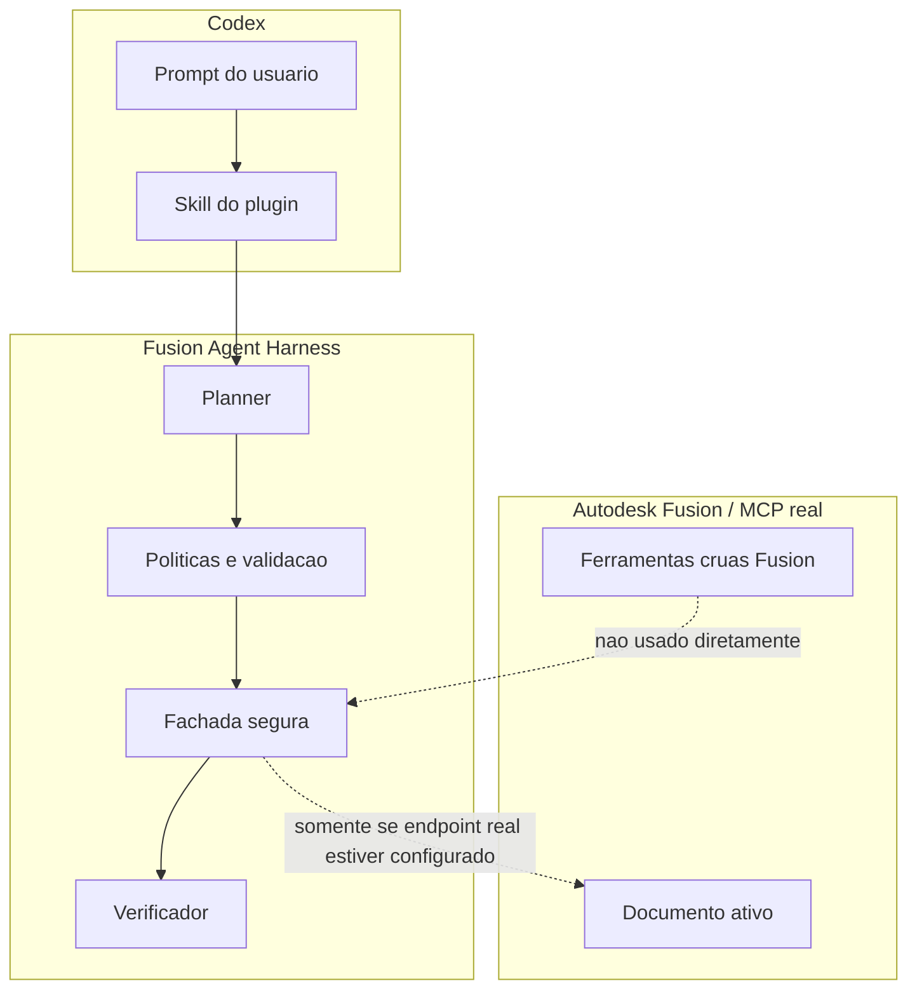
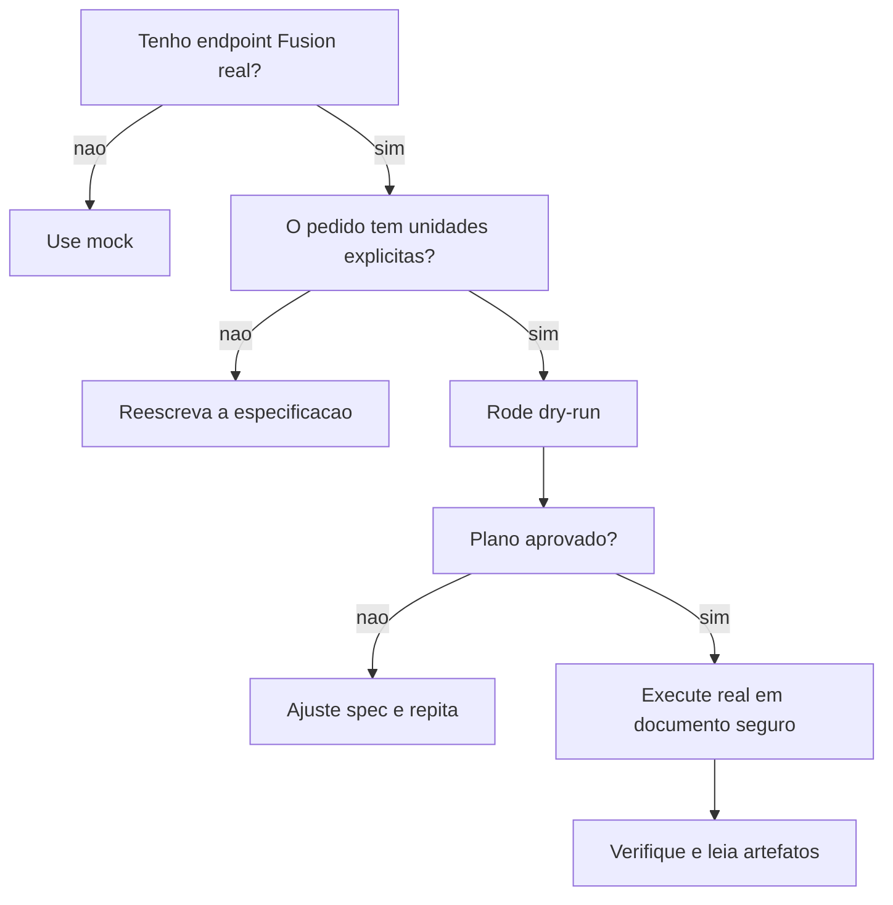

# Fusion360 Plugin para Codex

<p align="center">
  <strong>Plugin local do Codex para automacao CAD segura com Autodesk Fusion 360 via Fusion Agent Harness.</strong>
</p>

<p align="center">
  <a href="https://github.com/matheusfalcaopinto/Fusion360-Plugin"></a>
  
  
  
  
  <a href="LICENSE"></a>
</p>

> [!IMPORTANT]
> Este plugin nao expoe ferramentas MCP cruas do Autodesk Fusion para o Codex.
> Toda acao CAD passa pelo servidor seguro `fusion_agent`, com planejamento,
> validacao, modo mock/dry-run, verificacao programatica, reparo limitado e
> rastreabilidade por artefatos.
> O segundo servidor opcional `fusion_data` e reservado aos dados cloud da
> Autodesk e usa OAuth gerenciado pelo proprio Codex.

## Sumario

- [Visao Geral](#visao-geral)
- [O Que Vem No Plugin](#o-que-vem-no-plugin)
- [Arquitetura Visual](#arquitetura-visual)
- [Modelo De Seguranca](#modelo-de-seguranca)
- [Requisitos](#requisitos)
- [Instalacao Rapida](#instalacao-rapida)
- [Instalacao No Codex](#instalacao-no-codex)
- [Primeira Verificacao](#primeira-verificacao)
- [Como Usar No Codex](#como-usar-no-codex)
- [Modos De Execucao](#modos-de-execucao)
- [Variaveis De Ambiente](#variaveis-de-ambiente)
- [Ferramentas MCP](#ferramentas-mcp)
- [Receitas De Prompt](#receitas-de-prompt)
- [Estrutura Do Repositorio](#estrutura-do-repositorio)
- [Troubleshooting](#troubleshooting)
- [Desenvolvimento](#desenvolvimento)
- [Publicacao](#publicacao)
- [Licenca](#licenca)

## Visao Geral

O **Fusion360 Plugin para Codex** empacota o **Fusion Agent Harness** como um
plugin local pronto para uso. Ele conecta o Codex a um servidor MCP chamado
`fusion_agent`, que atua como uma camada de transacao segura entre linguagem
natural e operacoes CAD.

Em vez de deixar o Codex chamar comandos Fusion diretamente, o plugin mantem uma
transporte MCP serializado, aplica politica de replay conforme o efeito da
chamada e oferece duas rotas seguras: o Safe Harness legado e o Native Fast
Path com lint, baseline e readback programatico.

| Capacidade | O que entrega |
| --- | --- |
| Planejamento CAD | Converte pedidos em CAD Specs com nomes, unidades e parametros claros. |
| Transporte controlado | Nunca repete automaticamente uma mutacao depois do dispatch; outcome incerto exige readback. |
| CadSpec v2 | Operacoes discriminadas, referencias tipadas, dependencias e requisitos verificaveis, sem campos extras silenciosos. |
| Perfis MCP | `normal` expoe 12 ferramentas orientadas a tarefa; superficies especializadas ficam em `advanced`, `diagnostic`, `benchmark` e `all`. |
| Backends explicitos | `autodesk_http` e `faust_stdio` sao selecionados no startup, sem fallback automatico. |
| Native Fast Path | Consulta a API, inspeciona alvos e executa um script limitado com uma unica escrita. |
| Guardrail de planner | Bloqueia prompts de auditoria, hub, reorg e delete para evitar specs genericas. |
| Snapshots compactos | Coleta ocorrencias, corpos visiveis, bboxes e duplicidades como evidencia primaria. |
| Mudancas seguras | Exige preview, baseline, lotes pequenos e aborta em regressao visivel. |
| Mock-first | Permite testar sem Autodesk Fusion aberto ou instalado. |
| Dry-run | Valida intencao antes de qualquer escrita real. |
| Verificacao | Confere corpos, parametros, bounding boxes, features, exports e screenshots. |
| Reparos limitados | Classifica falhas e evita loops abertos. |
| Memoria de projeto | Schema v2 com origem, proveniencia, confianca, hash, expiracao, citacoes e taint. |
| Journals e traces | Produz artefatos para auditoria e diagnostico. |

## O Que Vem No Plugin

| Area | Arquivo | Funcao |
| --- | --- | --- |
| Manifesto Codex | `.codex-plugin/plugin.json` | Descreve nome, versao, skill, MCP e metadados do plugin. |
| MCP local | `.mcp.json` | Registra o servidor `fusion_agent` para o Codex. |
| Skill | `skills/fusion-cad-harness/SKILL.md` | Ensina o Codex a usar o harness com limites seguros. |
| Launcher | `scripts/fusion_agent_codex_mcp_launcher.py` | Resolve Python, ambiente e inicia `fusion_agent_mcp.server`. |
| Setup Windows | `scripts/setup.ps1` | Cria `.venv`, instala o wheel e roda checagens. |
| Setup Linux/macOS | `scripts/setup.sh` | Fluxo equivalente para shells POSIX. |
| Validator | `scripts/validate_plugin.py` | Confere manifest, MCP, wheel e ferramentas publicas esperadas. |
| Fonte canônica | `harness/` | Fonte rastreada usada para testes e build reproduzivel. |
| Runtime Python | `wheels/fusion_agent_harness-0.3.0-py3-none-any.whl` | Pacote do harness embutido na distribuicao. |

## Arquitetura Visual

### Pipeline Seguro



### Fronteira De Seguranca



> [!WARNING]
> Nao adicione servidores MCP chamados `fusion360`, `autodesk_fusion` ou
> equivalentes ao fluxo local deste plugin. `fusion_agent` e a unica superficie
> CAD executora; `fusion_data`, quando configurado, e um segundo MCP oficial
> somente para dados cloud e nunca chama o harness.

## Modelo De Seguranca

O plugin foi desenhado para falhar fechado.

| Regra | Motivo |
| --- | --- |
| Readiness interno | Cada ferramenta prepara a conexao quando necessario; diagnostico amplo e executado sob pedido ou falha. |
| Exija unidades explicitas | CAD nao deve inferir se `10` significa mm, cm ou polegadas. |
| Planeje somente criacao CAD conhecida | Auditoria, hub, reorg e cleanup usam ferramentas proprias. |
| Verifique por dados | Snapshots e checks programaticos sao prova primaria; screenshots sao secundarios. |
| Proteja delete por baseline | `allow_delete=false` por padrao, confirmacao destrutiva e primeiro lote `<=5`. |
| Repare com limite | Falhas devem ser classificadas, nao mascaradas por repeticao infinita. |
| Proteja documentos existentes | Inspecao e checkpoint reduzem risco de perda de trabalho. |

Gates profissionais podem encerrar a execucao com causas como:

```text
METADATA_MISSING
JOINT_MISMATCH
INTERFERENCE_DETECTED
PHYSICAL_PROPERTY_MISMATCH
SCREENSHOT_FAILED
```

### Mutacao, contrato e drift

`dispatched`, `may_have_applied`, `post_dispatch_replay_suppressed` e
`mutation_outcome` descrevem o transporte. Timeout depois do dispatch retorna
`MUTATION_OUTCOME_UNKNOWN`; a mutacao nao e reenviada e a recuperacao exige
inspecao/readback.

A verificacao separa `mutation_status`, `assertion_status`, `intent_coverage` e
`verification_level`. Um contrato so e considerado completo quando o readback
confirma a mutacao, todas as assertions/requisitos obrigatorios estao cobertos
e a inspecao terminou completa. Em snapshots parciais, a conclusao maxima e
`no_drift_in_observed_scope`.

Safe Change usa preview v2 com identidade estavel, fingerprint e bindings. O
estado progride atomicamente por `ready -> applying -> consumed`; qualquer
drift torna o preview `stale`, e qualquer dispatch o consome mesmo se o outcome
ficar desconhecido.

## Requisitos

### Obrigatorios

- Codex Desktop ou ambiente Codex com suporte a plugins locais.
- Python **3.11+** disponivel como `python` ou definido por
  `FUSION_AGENT_PYTHON`.
- Permissao de escrita no diretorio do plugin para criar `.venv`.

### Para Fusion real

- Autodesk Fusion instalado, normalmente em Windows.
- Servidor MCP/Fusion real acessivel por endpoint ou comando.
- `FUSION_MCP_ENDPOINT` configurado quando o endpoint for remoto.
- Documento descartavel ou checkpoint antes de qualquer escrita real.

### Dependencias instaladas pelo wheel

| Dependencia | Versao minima |
| --- | --- |
| `pydantic` | `2.0` |
| `typer` | `0.12` |
| `pytest` | `8.0` |
| `pytest-asyncio` | `0.23` |
| `rich` | `13.0` |
| `jsonschema` | `4.0` |
| `mcp` | `>=1.28,<2` |
| `python-dotenv` | `1.0` |
| `PyYAML` | `6.0` |

## Instalacao Rapida

```powershell
git clone https://github.com/matheusfalcaopinto/Fusion360-Plugin.git
cd Fusion360-Plugin
.\scripts\setup.ps1
```

Linux/macOS:

```bash
git clone https://github.com/matheusfalcaopinto/Fusion360-Plugin.git
cd Fusion360-Plugin
bash scripts/setup.sh
```

O setup cria `.venv`, instala o wheel em `wheels/` e executa uma checagem basica
do launcher. Ao final, ele substitui o comando portatil de `.mcp.json` pelos
caminhos absolutos do interpretador e do launcher desta instalacao. Isso evita
o alias `WindowsApps` no Windows e torna explicito qual ambiente hospeda o MCP.

Faust e opcional e explicitamente pinado:

```powershell
.\.venv\Scripts\python.exe -m pip install "fusion360-mcp-server==0.1.0"
.\.venv\Scripts\python.exe scripts\configure_mcp.py --plugin-root . --python .\.venv\Scripts\python.exe --backend faust_stdio
```

Fusion Data nao tem URL presumida no repositorio. Habilite-o somente com uma
URL HTTPS confirmada pela documentacao/conexao oficial da Autodesk:

```powershell
.\.venv\Scripts\python.exe scripts\configure_mcp.py --plugin-root . --python .\.venv\Scripts\python.exe --enable-fusion-data --fusion-data-url "<URL-oficial>"
```

O Codex gerencia OAuth e approvals; nenhum token Fusion Data entra no ambiente
do `fusion_agent`.

> [!TIP]
> Se `python` nao estiver no `PATH`, defina `FUSION_AGENT_PYTHON` com o caminho
> absoluto do interpretador antes de rodar o setup.
> No Windows instalado pelo Codex, prefira o Python explicito da `.venv` do
> plugin quando diagnosticar cache ou anexo de ferramentas.

## Instalacao No Codex

Este repositorio ja esta no formato de plugin local do Codex. Mantenha a raiz do
repositorio como raiz do plugin.

### Opcao A: usar o checkout diretamente

1. Clone este repositorio em uma pasta estavel.
2. Rode `scripts/setup.ps1` ou `scripts/setup.sh`.
3. Aponte o Codex para a raiz deste repositorio.
4. Recarregue o Codex se necessario.

### Opcao B: preparar uma fonte pessoal limpa

Copie somente os artefatos intencionais para o diretorio de plugins pessoais do
Codex e rode:

```powershell
.\scripts\setup.ps1
```

Mantenha estes caminhos juntos:

```text
.codex-plugin/plugin.json
.mcp.json
skills/
scripts/
wheels/
harness/
```

Em `scripts/`, copie somente `build-distribution.py`, `configure_mcp.py`,
`fusion_agent_codex_mcp_launcher.py`, `setup.ps1`, `setup.sh` e
`validate_plugin.py`. Nao leve `.venv`, logs, manifests, outputs, workspace,
arquivos de teste locais ou outros scripts de projeto para a fonte pessoal; o
cache do Codex inclui o conteudo da origem do plugin.

O launcher calcula a raiz do plugin a partir da pasta `scripts/`. Mover apenas o
launcher ou apenas o wheel quebra a resolucao de caminhos.

## Primeira Verificacao

Windows:

```powershell
.\.venv\Scripts\python.exe scripts\fusion_agent_codex_mcp_launcher.py --check
```

Linux/macOS:

```bash
./.venv/bin/python scripts/fusion_agent_codex_mcp_launcher.py --check
```

Saida esperada:

| Campo | Esperado |
| --- | --- |
| `plugin_root` | Caminho para este repositorio. |
| `harness_root` | `<installed-package>` em instalacao normal. |
| `bundled_wheels` | Exatamente `1`. |
| `installed_server_available` | `True`. |
| `fusion_agent_codex` | `1`. |

<details>
<summary>Exemplo de leitura da checagem</summary>

```text
plugin_root=C:\...\Fusion360-Plugin
harness_root=<installed-package>
python=C:\...\Fusion360-Plugin\.venv\Scripts\python.exe
bundled_wheels=1
installed_server_available=True
fusion_agent_codex=1
```

Se `installed_server_available=False`, o Python escolhido pelo launcher ainda
nao consegue importar `fusion_agent_mcp.server`.

</details>

## Como Usar No Codex

Quando o plugin estiver ativo, o Codex deve carregar a skill
`fusion-cad-harness` e usar o servidor MCP `fusion_agent`.

Fluxo recomendado para criacao/modelagem CAD:

```mermaid
sequenceDiagram
  participant U as Usuario
  participant C as Codex
  participant H as fusion_agent
  participant F as Fusion real ou mock

  U->>C: Descreve a peca ou montagem
  C->>H: native_read(api_documentation)
  C->>H: targeted_inspect(baseline)
  H-->>C: API, identidade e alvos unicos
  C->>C: gera script e contrato de verificacao
  C->>H: fast_execute ou Safe Harness
  H->>F: no maximo um dispatch; sem replay automatico depois dele
  H->>F: readback direcionado
  H-->>C: estado, assertions, traces e evidencias
```

Checklist de uso:

- comece pela ferramenta especifica; `doctor`, `probe`, `session_health` e
  inspecao ampla ficam para diagnostico solicitado ou falha de readiness;
- recupere memoria pelo recurso paginado `fusion-agent://memory/{project}`;
- para uma operacao nativa elegivel, consulte somente a documentacao necessaria
  com `fusion_agent_native_read`, delimite alvos com
  `fusion_agent_targeted_inspect` e declare assertions no
  `fusion_agent_fast_execute`;
- para criacao CAD conhecida, prefira CadSpec v2 estrito; CadSpec v1 continua
  aceito em 0.x com warning e sem verificacao contratual completa;
- para auditoria, inventario de hub, reorg, cleanup ou delete, nao use o
  planner; use `fusion_agent_compact_snapshot`,
  `fusion_agent_safe_change_preview`; inventario cloud pertence ao MCP opcional
  `fusion_data`;
- use Safe Harness para delete, cleanup, bulk, move, visibilidade,
  componentize, entidades ocultas/importadas/compartilhadas e ambiguidade;
- use `fusion_agent_dry_run_session` e `fusion_agent_run_session` para receitas
  CadSpec legadas quando forem a rota recomendada;
- valide com `fusion_agent_verify_active_design`;
- capture evidencia visual com `fusion_agent_capture_viewport` somente como
  evidencia secundaria e exija `evidence_quality=verified_file`;
- leia artefatos e traces quando houver divergencias.

> [!NOTE]
> Pedidos CAD devem ter unidades explicitas: `120 mm`, `45 deg`,
> `plate_length = 100 mm`. O plugin deve rejeitar dimensoes ambiguas.

## Modos De Execucao

| Modo | Quando usar | Risco | Saida esperada |
| --- | --- | --- | --- |
| `mock` | Instalacao, testes, demos e prompts novos. | Baixo. | Artefatos simulados e verificaveis. |
| `dry-run` | Revisao antes de escrita real. | Baixo a medio. | Plano executavel sem alterar documento. |
| `real` | Execucao em Fusion configurado. | Alto. | Alteracoes em documento ativo e verificacao. |



Endpoint real no Windows:

```powershell
$env:FUSION_MCP_ENDPOINT = "http://127.0.0.1:27182/mcp"
```

Linux conectando por tunnel SSH para o loopback do host Windows:

```bash
ssh -L 27182:127.0.0.1:27182 <windows-host>
export FUSION_MCP_ENDPOINT="http://127.0.0.1:27182/mcp"
```

Um endpoint remoto direto exige HTTPS, allowlist e token do ambiente; DNS e
revalidado antes das chamadas para bloquear rebinding.

## Variaveis De Ambiente

| Variavel | Obrigatoria? | Uso |
| --- | --- | --- |
| `FUSION_AGENT_CODEX` | Nao | Definida como `1` pelo plugin para indicar execucao via Codex. |
| `FUSION_AGENT_PYTHON` | Opcional | Caminho explicito para o Python que hospeda o MCP server. |
| `FUSION_AGENT_HARNESS_ROOT` | Dev only | Checkout fonte do harness, usado em vez do wheel instalado. |
| `FUSION_AGENT_TOOL_PROFILE` | Opcional | `normal` (padrao), `advanced`, `diagnostic`, `benchmark` ou `all`. |
| `FUSION_AGENT_BACKEND` | Opcional | `autodesk_http` (padrao) ou `faust_stdio`; nunca ha fallback automatico. |
| `FUSION_MCP_ENDPOINT` | Real Fusion Autodesk | Endpoint do backend local Autodesk; loopback-only por padrao. |
| `FUSION_FAUST_COMMAND` | Faust | Comando da sessao stdio persistente `fusion360-mcp-server==0.1.0`. |
| `FUSION_AGENT_REMOTE_POLICY` | Opcional | `loopback_only` (padrao) ou `allowlist` para HTTPS remoto autenticado. |
| `FUSION_AGENT_REMOTE_ALLOWLIST` | Remoto | Hosts/CIDRs permitidos quando a politica remota e `allowlist`. |
| `FUSION_MCP_BEARER_TOKEN` | Remoto | Token lido somente do ambiente e redigido de logs. |
| `FUSION_MCP_TRANSPORT_MODE` | Opcional | `legacy`, `persistent_post_only`, `auto` ou `persistent` diagnostico. |
| `FUSION_MCP_CONNECT_TIMEOUT_SECONDS` | Opcional | Timeout de conexao; padrao `5`. |
| `FUSION_MCP_READ_TIMEOUT_SECONDS` | Opcional | Timeout de leitura; padrao `120`. |
| `FUSION_MCP_MUTATION_TIMEOUT_SECONDS` | Opcional | Timeout de mutacao; padrao `240`. |
| `FUSION_MCP_SSE_TIMEOUT_SECONDS` | Opcional | Timeout do stream SSE; padrao `300`. |
| `FUSION_MCP_AUTO_CANARY_TIMEOUT_SECONDS` | Opcional | Limite do canario `auto`; padrao `2`. |
| `FUSION_MCP_TRUSTED_READ_TIMEOUT_SECONDS` | Opcional | Timeout de scripts internos auditados; padrao `10`. |
| `FUSION_MCP_POST_DISPATCH_COOLDOWN_SECONDS` | Opcional | Bloqueio local apos outcome incerto; padrao `5`. |
| `FUSION_AGENT_INSPECTION_MAX_ENTITIES` | Opcional | Budget default de entidades visitadas; padrao `1000`. |
| `FUSION_AGENT_INSPECTION_DEADLINE_MS` | Opcional | Deadline default de inspecao; padrao `1500`. |
| `FUSION_AGENT_INSPECTION_MAX_RESPONSE_BYTES` | Opcional | Teto default de resposta; padrao `1048576`. |
| `FUSION_AGENT_FAST_PATH_MODE` | Opcional | `off`, `read_only` ou `enabled`; mutacao apenas em `advanced/all` e nunca no Faust. |
| `FUSION_AGENT_EXPERIMENTAL_MANUFACTURING` | Experimental | `1` habilita APIs sheet metal/CAM somente em `advanced/all`. |
| `FUSION_AGENT_MAX_PROTECTED_SCRIPT_BYTES` | Opcional | Limite fail-closed do script final transmitido pelo Fast Execute, depois dos guards; padrao `28672` (28 KiB). |
| `FUSION_AGENT_EXECUTION_PATH` | Teste/benchmark | `auto` (padrao), `native_fast` ou `safe_harness`; valores fixos travam a rota. |
| `FUSION_AGENT_TELEMETRY` | Opcional | Quando `1`, grava telemetria local redigida; nenhum conteudo e enviado externamente. |
| `FUSION_AGENT_REQUIRE_REAL` | Opcional | Forca modo real e bloqueia mock quando definido como `1`. |
| `FUSION_AGENT_ALLOW_DRY_RUN` | Opcional | Quando `0`, bloqueia dry-run no ambiente instalado real-first. |
| `PYTHONPATH` | Automatico | Ajustado pelo launcher quando `FUSION_AGENT_HARNESS_ROOT` esta definido. |

`legacy` abre uma sessao one-shot por operacao e usa readiness/manifest em
cache. `persistent_post_only` mantem uma sessao usando POST e o SSE retornado
pela propria resposta, sem abrir o GET/SSE independente. `auto` executa um
canario de leitura de dois segundos e fixa `legacy` para o restante do processo
se o canario falhar. O modo `persistent` completo permanece disponivel somente
para diagnostico explicito na serie 0.2.x.

Scripts internos de inspecao e mutacoes usam replay `BEFORE_DISPATCH_ONLY`.
Isso significa **sem replay automatico depois do dispatch**, nao idempotencia
end-to-end. Se uma leitura desse tipo expirar depois do dispatch,
o harness retorna `READ_TIMEOUT_MAY_STILL_BE_RUNNING`, invalida a sessao e
aplica cooldown; o script nao e reenviado automaticamente.

### Orcamentos de inspecao

As ferramentas `fusion_agent_inspect`, `fusion_agent_targeted_inspect` e
`fusion_agent_compact_snapshot` aceitam campos opcionais e compativeis:

| Campo | Padrao | Maximo | Funcao |
| --- | ---: | ---: | --- |
| `max_entities_visited` | `1000` | `5000` | Interrompe a travessia real, nao apenas a serializacao. |
| `deadline_ms` | `1500` | `5000` | Deadline monotonicamente verificado durante o scan. |
| `max_response_bytes` | `1048576` | `1048576` | Limita a resposta estruturada a 1 MiB. |

Resultados limitados informam `complete`, `truncated`, `visited_entities`,
`elapsed_ms`, `response_bytes`, `counts_exact` e `stop_reason`. O modo padrao de
`fusion_agent_inspect` retorna identidade do documento e contagens baratas;
geometria, parametros, assembly, propriedades fisicas e metricas legadas devem
ser solicitados explicitamente. Um baseline incompleto nunca autoriza uma
mudanca Safe Harness.

## Ferramentas MCP

A superficie e filtrada tanto em `tools/list` quanto em `tools/call`. Uma
ferramenta escondida falha antes do handler com
`TOOL_NOT_AVAILABLE_IN_PROFILE`.

| Perfil | Superficie |
| --- | --- |
| `normal` | 12 ferramentas para readiness, leitura direcionada, snapshot, CadSpec, sessao, verificacao, Safe Change, recovery e viewport. |
| `advanced` | `normal` mais Fast Path, inspecao ampla, dry-run/export, inventario e memoria. |
| `diagnostic` | Readiness, doctor, probe, health, discovery, mapping e inspecoes somente leitura. |
| `benchmark` | Runner, relatorios e leituras/verificacoes de fixtures isoladas; mutacao direta fica oculta. |
| `all` | As 35 ferramentas legadas da serie 0.x. |

Leitores repetitivos foram substituidos fora de `all` por recursos paginados:
`fusion-agent://sessions/...`, `artifact/...`, `traces/...`, `manifests/...`,
`skills/...`, `memory/...` e `benchmarks/...`. O servidor tambem publica os
prompts `fusion-inspect-plan-verify`, `fusion-safe-change`,
`fusion-recover-unknown-outcome` e `fusion-benchmark-case`.

A skill agrupa a superficie completa de compatibilidade em familias:

| Grupo | Ferramentas |
| --- | --- |
| Sessao e ambiente | `fusion_agent_doctor`, `fusion_agent_readiness_report`, `fusion_agent_probe`, `fusion_agent_session_health`, `fusion_agent_inspect`, `fusion_agent_run_session`, `fusion_agent_dry_run_session`, `fusion_agent_list_sessions` |
| Native Fast Path | `fusion_agent_native_read`, `fusion_agent_targeted_inspect`, `fusion_agent_fast_execute`, `fusion_agent_recover_change` |
| Verificacao e evidencia | `fusion_agent_verify_active_design`, `fusion_agent_compact_snapshot`, `fusion_agent_capture_viewport` |
| Inventario de hub | `fusion_agent_hub_inventory` |
| Mudancas seguras | `fusion_agent_safe_change_preview`, `fusion_agent_safe_change_apply` |
| Artefatos e traces | `fusion_agent_read_session_artifact`, `fusion_agent_read_trace` |
| Planejamento | `fusion_agent_plan_spec`, `fusion_agent_validate_spec`, `fusion_agent_export_spec_json` |
| Benchmarks | `fusion_agent_list_benchmarks`, `fusion_agent_run_benchmark`, `fusion_agent_read_benchmark_report` |
| Descoberta controlada | `fusion_agent_discover_tools`, `fusion_agent_propose_mapping`, `fusion_agent_read_manifest` |
| Memoria | `fusion_agent_memory_search`, `fusion_agent_memory_write`, `fusion_agent_memory_list_project` |
| Skills do harness | `fusion_agent_skills_list`, `fusion_agent_skills_get`, `fusion_agent_skills_rank` |

O gate de PR usa `driver=internal, mode=mock`. O runtime inclui o lifecycle
auditado para criar, marcar, fechar sem salvar e restaurar uma fixture real,
usando `dataFile.id` ou o marker como identidade estavel. A suite real stock
ainda falha no preflight, antes da primeira chamada MCP, enquanto nao houver
fixtures, acoes de rota, oracles e auditoria de containment registrados e
revisados para cada caso. A saida do proprio executor nunca e aceita como prova
de correcao. Mutacao real exige `confirm_real_benchmark=true`; um documento
original nao salvo e sem identidade persistente tambem bloqueia antes da
criacao da fixture.

O Fast Execute mede o payload final, ja com o guard de identidade do documento
e o preambulo de normalizacao dos streams. Acima do limite configurado, retorna
`SCRIPT_SIZE_LIMIT_EXCEEDED` antes do dispatch e recomenda decompor a tarefa ou
usar o Safe Harness. Ele nunca trunca nem reenvia silenciosamente o script.

A investigação Claude/Codex usa uma matriz causal separada do benchmark
safe-vs-fast do produto. Consulte
[`CAUSAL_BENCHMARK.md`](benchmark_parametric_ab/CAUSAL_BENCHMARK.md) para as
camadas e schemas offline e
[`REAL_VALIDATION_RUNBOOK.md`](benchmark_parametric_ab/REAL_VALIDATION_RUNBOOK.md)
para a campanha interativa adiada.

## Receitas De Prompt

### Inspecionar ambiente

```text
Use o Fusion Agent Harness para consultar active_command e o documento com
native_read. Rode doctor, probe e session_health somente se a readiness falhar.
```

### Inventariar Personal Library

```text
Use o Fusion Agent Harness para inventariar minha Personal Library com
hub_inventory. Nao abra nem modifique designs; quero somente metadados e
enriquecimento por findFileById quando disponivel.
```

### Auditar montagem grande

```text
Use compact_snapshot no Fusion real para auditar a montagem ativa. Quero
ocorrencias visiveis, corpos visiveis, bboxes, nomes duplicados e limites de
payload. Screenshots sao apenas evidencia secundaria.
```

### Preparar cleanup destrutivo

```text
Crie um safe_change_preview para revisar alvos ocultos. Nao aplique nada ainda.
Delete deve ficar bloqueado por padrao se houver risco de definicao
compartilhada ou perda visivel.
```

### Planejar peca com unidades explicitas

```text
Planeje e rode dry-run de uma placa de montagem de 100 mm x 60 mm x 6 mm, com
quatro furos de 5 mm a 10 mm das bordas, nomes estaveis para parametros e
verificacao de bounding box.
```

### Executar pelo Native Fast Path

```text
Use somente fusion_agent_*. Consulte api_documentation para as classes exatas,
inspecione o documento e o alvo com targeted_inspect, gere um script com um
unico run(_context: str) e envie fast_execute com change_class, target_query_ids
e assertions programaticas. Em scoped_update, altere somente
targets[query_id]. Em additive, declare component_path exato + name na query do
novo alvo e crie somente a partir de target_components[component_path]. Nao
redescubra alvos no script. Converta pontos com sketch.modelToSketchSpace, sem
reconstruir manualmente os eixos xDirection/yDirection. Nao salve nem desfaça
automaticamente.
```

### Executar sessao mock

```text
Execute em mock uma peca chamada base_plate_demo: placa 120 mm x 80 mm x 8 mm,
quatro furos M5, chanfro de 1 mm nas bordas externas e captura de evidencia.
```

### Trabalhar com montagem

```text
Crie em mock uma montagem de duas placas separadas por quatro standoffs de
25 mm, com contratos de junta rigida, metadados e verificacao de interferencia.
```

### Verificar divergencias

```text
Verifique o design ativo contra a especificacao planejada, leia os artefatos da
sessao e resuma qualquer divergencia entre geometria, nomes e propriedades.
```

<details>
<summary>Prompt mais completo para sessao real cautelosa</summary>

```text
Use somente o servidor fusion_agent. Consulte api_documentation, faca uma
targeted_inspect e busque memory_search. Depois crie uma CAD Spec com unidades explicitas para uma placa de montagem de
120 mm x 80 mm x 8 mm, quatro furos M5 a 12 mm das bordas, chanfro externo de
1 mm e parametros nomeados. Rode dry-run primeiro. Nao execute real ate listar
riscos, plano, nomes esperados e verificacoes. Depois de aprovado, execute em
documento descartavel, valide bounding box, furos, nomes, feature health e
capture viewport.
```

</details>

## Estrutura Do Repositorio

```text
.
|-- .codex/
|   `-- config.toml
|-- .codex-plugin/
|   `-- plugin.json
|-- .github/
|   |-- ISSUE_TEMPLATE/
|   `-- PULL_REQUEST_TEMPLATE.md
|-- scripts/
|   |-- build-distribution.py
|   |-- fusion_agent_codex_mcp_launcher.py
|   |-- setup.ps1
|   `-- setup.sh
|-- skills/
|   `-- fusion-cad-harness/
|       `-- SKILL.md
|-- harness/
|   |-- pyproject.toml
|   |-- apps/
|   |-- packages/
|   `-- tests/
|-- wheels/
|   `-- fusion_agent_harness-0.3.0-py3-none-any.whl
|-- .editorconfig
|-- .gitattributes
|-- .gitignore
|-- .mcp.json
|-- CHANGELOG.md
|-- CONTRIBUTING.md
|-- LICENSE
|-- README.md
`-- SECURITY.md
```

## Troubleshooting

<details>
<summary><code>python</code> nao encontrado</summary>

Instale Python 3.11+ ou defina:

```powershell
$env:FUSION_AGENT_PYTHON = "C:\Caminho\Para\python.exe"
.\scripts\setup.ps1
```

</details>

<details>
<summary><code>installed_server_available=False</code></summary>

O wheel pode nao ter sido instalado no Python que o launcher esta usando.
Confira:

```powershell
.\.venv\Scripts\python.exe -m pip show fusion-agent-harness
.\.venv\Scripts\python.exe scripts\fusion_agent_codex_mcp_launcher.py --check
```

Se necessario, rode `.\scripts\setup.ps1` novamente.

</details>

<details>
<summary><code>Missing bundled fusion_agent_harness wheel</code></summary>

Confirme se o arquivo existe em `wheels/`. Este repositorio deve publicar o
wheel porque ele faz parte da distribuicao do plugin.

```text
wheels/fusion_agent_harness-0.3.0-py3-none-any.whl
```

</details>

<details>
<summary>Codex nao mostra o servidor <code>fusion_agent</code></summary>

Confira:

- `.codex-plugin/plugin.json` existe na raiz do plugin;
- `.mcp.json` existe na raiz do plugin;
- o setup foi executado com sucesso;
- o Codex foi recarregado depois da instalacao;
- o caminho configurado aponta para a raiz do repositorio, nao para `scripts/`.

</details>

<details>
<summary>Conexao real com Fusion falha</summary>

Comece em mock/dry-run e valide:

- Autodesk Fusion esta aberto;
- o servidor MCP/Fusion real esta rodando;
- `FUSION_MCP_ENDPOINT` aponta para host e porta corretos;
- firewall permite conexao;
- o documento ativo e seguro para teste.

</details>

<details>
<summary>Inspecao deixa uma montagem grande sem resposta</summary>

Nao dispare outra inspecao ampla imediatamente. Se o resultado trouxer
`READ_TIMEOUT_MAY_STILL_BE_RUNNING`, respeite `retry_after_seconds`; o script
anterior pode continuar executando dentro do Fusion. Depois do cooldown, use
`fusion_agent_targeted_inspect` com entity token ou component path e os
orcamentos padrao. `fusion_agent_inspect` deve permanecer no resumo lazy, sem
`physical_properties` ou `legacy_recipe_metrics`, salvo necessidade explicita.

</details>

<details>
<summary>Unidades ambiguas</summary>

Reescreva a especificacao com unidades explicitas:

```text
Use 120 mm x 80 mm x 8 mm.
Crie furos de 5 mm.
Defina plate_length = 120 mm.
Use angulo de 45 deg.
```

</details>

## Desenvolvimento

Este repositorio inclui a fonte canonica em `harness/`. Testes normais importam
essa fonte; `scripts/build-distribution.py` produz o wheel reproduzivel. Para
desenvolver contra outro checkout, defina `FUSION_AGENT_HARNESS_ROOT`.

Windows:

```powershell
$env:FUSION_AGENT_HARNESS_ROOT = "C:\caminho\para\fusion-agent-harness"
.\scripts\setup.ps1
```

Linux/macOS:

```bash
export FUSION_AGENT_HARNESS_ROOT="/caminho/para/fusion-agent-harness"
bash scripts/setup.sh
```

Quando `FUSION_AGENT_HARNESS_ROOT` esta definido, o launcher monta `PYTHONPATH`
com `packages/` e `apps/` do checkout fonte. Em uma instalacao normal, deixe a
variavel vazia para usar o wheel embutido.

### Checklist de contribuicao

- Preserve o uso exclusivo de `fusion_agent`.
- Nao registre ferramentas MCP cruas do Fusion.
- Rode setup e launcher `--check`.
- Para comportamento CAD, valide em mock ou dry-run.
- Atualize `CHANGELOG.md` e este README quando a experiencia do usuario mudar.

## Publicacao

Versao atual: `0.3.0`.

Checklist de release:

1. Rode a suite completa contra `harness/`.
2. Rode `python scripts/build-distribution.py` duas vezes e confirme SHA-256
   identico.
3. Gere
   `fusion_agent_harness-<versao>-py3-none-any.whl`.
4. Mantenha exatamente um wheel intencional em `wheels/`.
5. Rode `python scripts/validate_plugin.py`, o launcher com `--check` e a suite
   `python -m pytest -q`.
6. Aplique o cachebuster `0.3.0+codex.<timestamp-UTC>` exclusivamente com o
   helper `update_plugin_cachebuster.py` do `plugin-creator`, somente depois desses
   gates.
7. Atualize uma fonte pessoal limpa, rode `setup.ps1` ou `setup.sh` e reinstale
   `fusion-agent-codex@personal`.
8. Em uma task nova, confirme a versao exata, o perfil `normal` com 12
   ferramentas, output schemas e somente nomes `fusion_agent_*`; `all` deve
   manter 35 durante a serie 0.x.
9. Atualize `README.md` e `CHANGELOG.md` e crie a tag correspondente, por
   exemplo `v0.3.0`. O workflow da tag recompila duas vezes, compara o wheel
   rastreado e publica plugin, wheel, notas e `SHA256SUMS`.

## Licenca

Distribuido sob a licenca MIT. Veja [LICENSE](LICENSE).
