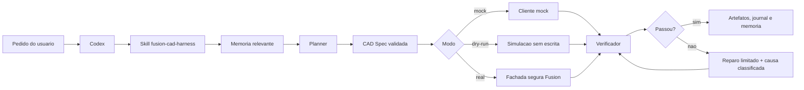
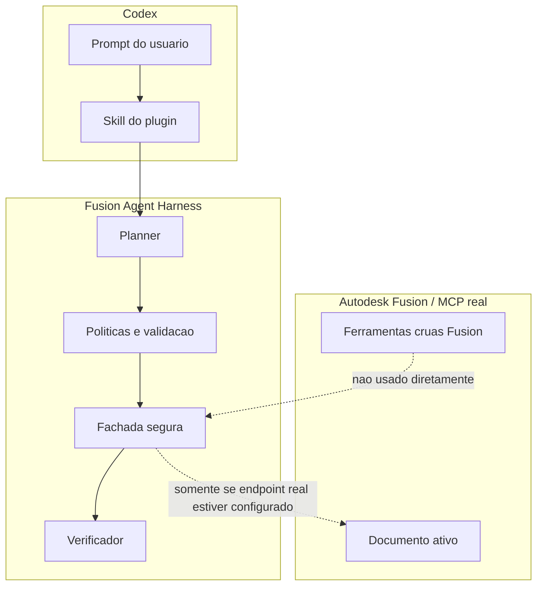
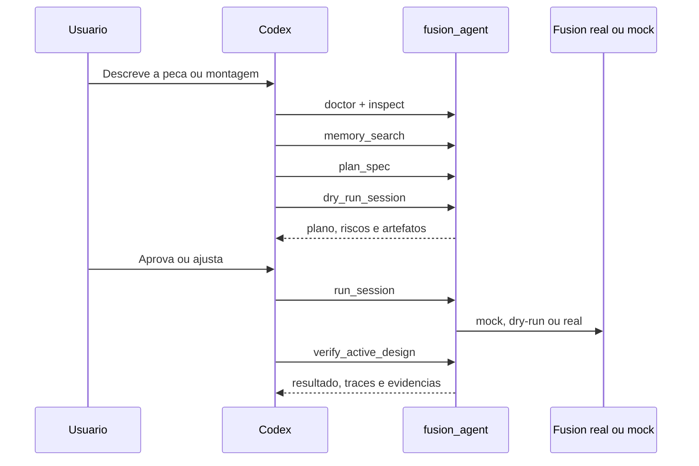
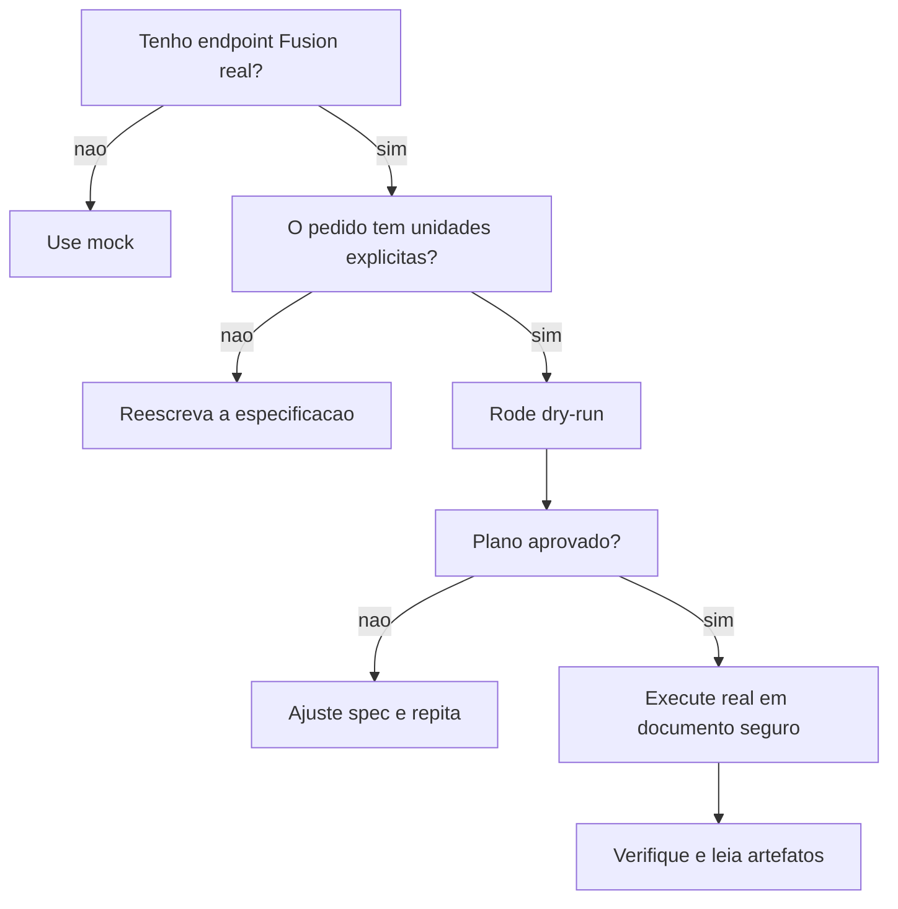

# Fusion360 Plugin para Codex

<p align="center">
  <strong>Plugin local do Codex para automacao CAD segura com Autodesk Fusion 360 via Fusion Agent Harness.</strong>
</p>

<p align="center">
  <a href="https://github.com/matheusfalcaopinto/Fusion360-Plugin"></a>
  
  
  
  
  <a href="LICENSE"></a>
</p>

> [!IMPORTANT]
> Este plugin nao expoe ferramentas MCP cruas do Autodesk Fusion para o Codex.
> Toda acao CAD passa pelo servidor seguro `fusion_agent`, com planejamento,
> validacao, modo mock/dry-run, verificacao programatica, reparo limitado e
> rastreabilidade por artefatos.

## Sumario

- [Visao Geral](#visao-geral)
- [O Que Vem No Plugin](#o-que-vem-no-plugin)
- [Arquitetura Visual](#arquitetura-visual)
- [Modelo De Seguranca](#modelo-de-seguranca)
- [Requisitos](#requisitos)
- [Instalacao Rapida](#instalacao-rapida)
- [Instalacao No Codex](#instalacao-no-codex)
- [Primeira Verificacao](#primeira-verificacao)
- [Como Usar No Codex](#como-usar-no-codex)
- [Modos De Execucao](#modos-de-execucao)
- [Variaveis De Ambiente](#variaveis-de-ambiente)
- [Ferramentas MCP](#ferramentas-mcp)
- [Receitas De Prompt](#receitas-de-prompt)
- [Estrutura Do Repositorio](#estrutura-do-repositorio)
- [Troubleshooting](#troubleshooting)
- [Desenvolvimento](#desenvolvimento)
- [Publicacao](#publicacao)
- [Licenca](#licenca)

## Visao Geral

O **Fusion360 Plugin para Codex** empacota o **Fusion Agent Harness** como um
plugin local pronto para uso. Ele conecta o Codex a um servidor MCP chamado
`fusion_agent`, que atua como uma camada de transacao segura entre linguagem
natural e operacoes CAD.

Em vez de deixar o Codex chamar comandos Fusion diretamente, o plugin transforma
o pedido em uma especificacao verificavel, executa primeiro em mock ou dry-run,
aplica politicas de seguranca e so entao permite uma sessao real quando o
ambiente esta claro.

| Capacidade | O que entrega |
| --- | --- |
| Planejamento CAD | Converte pedidos em CAD Specs com nomes, unidades e parametros claros. |
| Mock-first | Permite testar sem Autodesk Fusion aberto ou instalado. |
| Dry-run | Valida intencao antes de qualquer escrita real. |
| Verificacao | Confere corpos, parametros, bounding boxes, features, exports e screenshots. |
| Reparos limitados | Classifica falhas e evita loops abertos. |
| Memoria de projeto | Guarda decisoes factuais e aprendizados tecnicos. |
| Journals e traces | Produz artefatos para auditoria e diagnostico. |

## O Que Vem No Plugin

| Area | Arquivo | Funcao |
| --- | --- | --- |
| Manifesto Codex | `.codex-plugin/plugin.json` | Descreve nome, versao, skill, MCP e metadados do plugin. |
| MCP local | `.mcp.json` | Registra o servidor `fusion_agent` para o Codex. |
| Skill | `skills/fusion-cad-harness/SKILL.md` | Ensina o Codex a usar o harness com limites seguros. |
| Launcher | `scripts/fusion_agent_codex_mcp_launcher.py` | Resolve Python, ambiente e inicia `fusion_agent_mcp.server`. |
| Setup Windows | `scripts/setup.ps1` | Cria `.venv`, instala o wheel e roda checagens. |
| Setup Linux/macOS | `scripts/setup.sh` | Fluxo equivalente para shells POSIX. |
| Runtime Python | `wheels/fusion_agent_harness-0.1.0-py3-none-any.whl` | Pacote do harness embutido na distribuicao. |

## Arquitetura Visual

### Pipeline Seguro



### Fronteira De Seguranca



> [!WARNING]
> Nao adicione servidores MCP chamados `fusion360`, `autodesk_fusion` ou
> equivalentes ao fluxo do Codex para este plugin. A superficie suportada e
> somente `fusion_agent`.

## Modelo De Seguranca

O plugin foi desenhado para falhar fechado.

| Regra | Motivo |
| --- | --- |
| Comece em mock ou dry-run | Evita alteracoes involuntarias em documentos reais. |
| Exija unidades explicitas | CAD nao deve inferir se `10` significa mm, cm ou polegadas. |
| Planeje antes de executar | O usuario consegue revisar intencao, nomes e parametros. |
| Verifique por dados | Screenshots ajudam, mas nao substituem checks programaticos. |
| Repare com limite | Falhas devem ser classificadas, nao mascaradas por repeticao infinita. |
| Proteja documentos existentes | Inspecao e checkpoint reduzem risco de perda de trabalho. |

Gates profissionais podem encerrar a execucao com causas como:

```text
METADATA_MISSING
JOINT_MISMATCH
INTERFERENCE_DETECTED
PHYSICAL_PROPERTY_MISMATCH
SCREENSHOT_FAILED
```

## Requisitos

### Obrigatorios

- Codex Desktop ou ambiente Codex com suporte a plugins locais.
- Python **3.11+** disponivel como `python` ou definido por
  `FUSION_AGENT_PYTHON`.
- Permissao de escrita no diretorio do plugin para criar `.venv`.

### Para Fusion real

- Autodesk Fusion instalado, normalmente em Windows.
- Servidor MCP/Fusion real acessivel por endpoint ou comando.
- `FUSION_MCP_ENDPOINT` configurado quando o endpoint for remoto.
- Documento descartavel ou checkpoint antes de qualquer escrita real.

### Dependencias instaladas pelo wheel

| Dependencia | Versao minima |
| --- | --- |
| `pydantic` | `2.0` |
| `typer` | `0.12` |
| `pytest` | `8.0` |
| `pytest-asyncio` | `0.23` |
| `rich` | `13.0` |
| `jsonschema` | `4.0` |
| `mcp` | `1.0` |
| `python-dotenv` | `1.0` |
| `PyYAML` | `6.0` |

## Instalacao Rapida

```powershell
git clone https://github.com/matheusfalcaopinto/Fusion360-Plugin.git
cd Fusion360-Plugin
.\scripts\setup.ps1
```

Linux/macOS:

```bash
git clone https://github.com/matheusfalcaopinto/Fusion360-Plugin.git
cd Fusion360-Plugin
bash scripts/setup.sh
```

O setup cria `.venv`, instala o wheel em `wheels/` e executa uma checagem basica
do launcher.

> [!TIP]
> Se `python` nao estiver no `PATH`, defina `FUSION_AGENT_PYTHON` com o caminho
> absoluto do interpretador antes de rodar o setup.

## Instalacao No Codex

Este repositorio ja esta no formato de plugin local do Codex. Mantenha a raiz do
repositorio como raiz do plugin.

### Opcao A: usar o checkout diretamente

1. Clone este repositorio em uma pasta estavel.
2. Rode `scripts/setup.ps1` ou `scripts/setup.sh`.
3. Aponte o Codex para a raiz deste repositorio.
4. Recarregue o Codex se necessario.

### Opcao B: copiar para plugins pessoais

Copie a pasta inteira para o diretorio de plugins pessoais do Codex e rode:

```powershell
.\scripts\setup.ps1
```

Mantenha estes caminhos juntos:

```text
.codex-plugin/plugin.json
.mcp.json
skills/
scripts/
wheels/
```

O launcher calcula a raiz do plugin a partir da pasta `scripts/`. Mover apenas o
launcher ou apenas o wheel quebra a resolucao de caminhos.

## Primeira Verificacao

Windows:

```powershell
.\.venv\Scripts\python.exe scripts\fusion_agent_codex_mcp_launcher.py --check
```

Linux/macOS:

```bash
./.venv/bin/python scripts/fusion_agent_codex_mcp_launcher.py --check
```

Saida esperada:

| Campo | Esperado |
| --- | --- |
| `plugin_root` | Caminho para este repositorio. |
| `harness_root` | `<installed-package>` em instalacao normal. |
| `bundled_wheels` | `1` ou mais, conforme distribuicao. |
| `installed_server_available` | `True`. |
| `fusion_agent_codex` | `1`. |

<details>
<summary>Exemplo de leitura da checagem</summary>

```text
plugin_root=C:\...\Fusion360-Plugin
harness_root=<installed-package>
python=C:\...\Fusion360-Plugin\.venv\Scripts\python.exe
bundled_wheels=1
installed_server_available=True
fusion_agent_codex=1
```

Se `installed_server_available=False`, o Python escolhido pelo launcher ainda
nao consegue importar `fusion_agent_mcp.server`.

</details>

## Como Usar No Codex

Quando o plugin estiver ativo, o Codex deve carregar a skill
`fusion-cad-harness` e usar o servidor MCP `fusion_agent`.

Fluxo recomendado:



Checklist de uso:

- rode `fusion_agent_doctor` e `fusion_agent_inspect`;
- busque memoria com `fusion_agent_memory_search`;
- gere plano com `fusion_agent_plan_spec`;
- rode `fusion_agent_dry_run_session`;
- execute `fusion_agent_run_session` apenas quando o contexto estiver claro;
- valide com `fusion_agent_verify_active_design`;
- capture evidencia visual com `fusion_agent_capture_viewport`;
- leia artefatos e traces quando houver divergencias.

> [!NOTE]
> Pedidos CAD devem ter unidades explicitas: `120 mm`, `45 deg`,
> `plate_length = 100 mm`. O plugin deve rejeitar dimensoes ambiguas.

## Modos De Execucao

| Modo | Quando usar | Risco | Saida esperada |
| --- | --- | --- | --- |
| `mock` | Instalacao, testes, demos e prompts novos. | Baixo. | Artefatos simulados e verificaveis. |
| `dry-run` | Revisao antes de escrita real. | Baixo a medio. | Plano executavel sem alterar documento. |
| `real` | Execucao em Fusion configurado. | Alto. | Alteracoes em documento ativo e verificacao. |



Endpoint real no Windows:

```powershell
$env:FUSION_MCP_ENDPOINT = "http://127.0.0.1:27182/mcp"
```

Linux conectando a um host Windows:

```bash
export FUSION_MCP_ENDPOINT="http://<windows-host>:17182/mcp"
```

## Variaveis De Ambiente

| Variavel | Obrigatoria? | Uso |
| --- | --- | --- |
| `FUSION_AGENT_CODEX` | Nao | Definida como `1` pelo plugin para indicar execucao via Codex. |
| `FUSION_AGENT_PYTHON` | Opcional | Caminho explicito para o Python que hospeda o MCP server. |
| `FUSION_AGENT_HARNESS_ROOT` | Dev only | Checkout fonte do harness, usado em vez do wheel instalado. |
| `FUSION_MCP_ENDPOINT` | Real Fusion | Endpoint HTTP de um servidor MCP/Fusion real. |
| `PYTHONPATH` | Automatico | Ajustado pelo launcher quando `FUSION_AGENT_HARNESS_ROOT` esta definido. |

## Ferramentas MCP

A skill agrupa as ferramentas seguras em familias:

| Grupo | Ferramentas |
| --- | --- |
| Sessao e ambiente | `fusion_agent_doctor`, `fusion_agent_probe`, `fusion_agent_inspect`, `fusion_agent_run_session`, `fusion_agent_dry_run_session`, `fusion_agent_list_sessions` |
| Verificacao e evidencia | `fusion_agent_verify_active_design`, `fusion_agent_capture_viewport` |
| Artefatos e traces | `fusion_agent_read_session_artifact`, `fusion_agent_read_trace` |
| Planejamento | `fusion_agent_plan_spec`, `fusion_agent_validate_spec`, `fusion_agent_export_spec_json` |
| Benchmarks | `fusion_agent_list_benchmarks`, `fusion_agent_run_benchmark`, `fusion_agent_read_benchmark_report` |
| Descoberta controlada | `fusion_agent_discover_tools`, `fusion_agent_propose_mapping`, `fusion_agent_read_manifest` |
| Memoria | `fusion_agent_memory_search`, `fusion_agent_memory_write`, `fusion_agent_memory_list_project` |
| Skills do harness | `fusion_agent_skills_list`, `fusion_agent_skills_get`, `fusion_agent_skills_rank` |

## Receitas De Prompt

### Inspecionar ambiente

```text
Use o Fusion Agent Harness para rodar doctor e inspect. Quero saber se estou em
mock, dry-run ou conectado a um Fusion real.
```

### Planejar peca com unidades explicitas

```text
Planeje e rode dry-run de uma placa de montagem de 100 mm x 60 mm x 6 mm, com
quatro furos de 5 mm a 10 mm das bordas, nomes estaveis para parametros e
verificacao de bounding box.
```

### Executar sessao mock

```text
Execute em mock uma peca chamada base_plate_demo: placa 120 mm x 80 mm x 8 mm,
quatro furos M5, chanfro de 1 mm nas bordas externas e captura de evidencia.
```

### Trabalhar com montagem

```text
Crie em mock uma montagem de duas placas separadas por quatro standoffs de
25 mm, com contratos de junta rigida, metadados e verificacao de interferencia.
```

### Verificar divergencias

```text
Verifique o design ativo contra a especificacao planejada, leia os artefatos da
sessao e resuma qualquer divergencia entre geometria, nomes e propriedades.
```

<details>
<summary>Prompt mais completo para sessao real cautelosa</summary>

```text
Use somente o servidor fusion_agent. Rode doctor, inspect e memory_search.
Depois crie uma CAD Spec com unidades explicitas para uma placa de montagem de
120 mm x 80 mm x 8 mm, quatro furos M5 a 12 mm das bordas, chanfro externo de
1 mm e parametros nomeados. Rode dry-run primeiro. Nao execute real ate listar
riscos, plano, nomes esperados e verificacoes. Depois de aprovado, execute em
documento descartavel, valide bounding box, furos, nomes, feature health e
capture viewport.
```

</details>

## Estrutura Do Repositorio

```text
.
|-- .codex/
|   `-- config.toml
|-- .codex-plugin/
|   `-- plugin.json
|-- .github/
|   |-- ISSUE_TEMPLATE/
|   `-- PULL_REQUEST_TEMPLATE.md
|-- scripts/
|   |-- fusion_agent_codex_mcp_launcher.py
|   |-- setup.ps1
|   `-- setup.sh
|-- skills/
|   `-- fusion-cad-harness/
|       `-- SKILL.md
|-- wheels/
|   `-- fusion_agent_harness-0.1.0-py3-none-any.whl
|-- .editorconfig
|-- .gitattributes
|-- .gitignore
|-- .mcp.json
|-- CHANGELOG.md
|-- CONTRIBUTING.md
|-- LICENSE
|-- README.md
`-- SECURITY.md
```

## Troubleshooting

<details>
<summary><code>python</code> nao encontrado</summary>

Instale Python 3.11+ ou defina:

```powershell
$env:FUSION_AGENT_PYTHON = "C:\Caminho\Para\python.exe"
.\scripts\setup.ps1
```

</details>

<details>
<summary><code>installed_server_available=False</code></summary>

O wheel pode nao ter sido instalado no Python que o launcher esta usando.
Confira:

```powershell
.\.venv\Scripts\python.exe -m pip show fusion-agent-harness
.\.venv\Scripts\python.exe scripts\fusion_agent_codex_mcp_launcher.py --check
```

Se necessario, rode `.\scripts\setup.ps1` novamente.

</details>

<details>
<summary><code>Missing bundled fusion_agent_harness wheel</code></summary>

Confirme se o arquivo existe em `wheels/`. Este repositorio deve publicar o
wheel porque ele faz parte da distribuicao do plugin.

```text
wheels/fusion_agent_harness-0.1.0-py3-none-any.whl
```

</details>

<details>
<summary>Codex nao mostra o servidor <code>fusion_agent</code></summary>

Confira:

- `.codex-plugin/plugin.json` existe na raiz do plugin;
- `.mcp.json` existe na raiz do plugin;
- o setup foi executado com sucesso;
- o Codex foi recarregado depois da instalacao;
- o caminho configurado aponta para a raiz do repositorio, nao para `scripts/`.

</details>

<details>
<summary>Conexao real com Fusion falha</summary>

Comece em mock/dry-run e valide:

- Autodesk Fusion esta aberto;
- o servidor MCP/Fusion real esta rodando;
- `FUSION_MCP_ENDPOINT` aponta para host e porta corretos;
- firewall permite conexao;
- o documento ativo e seguro para teste.

</details>

<details>
<summary>Unidades ambiguas</summary>

Reescreva a especificacao com unidades explicitas:

```text
Use 120 mm x 80 mm x 8 mm.
Crie furos de 5 mm.
Defina plate_length = 120 mm.
Use angulo de 45 deg.
```

</details>

## Desenvolvimento

Este repositorio e uma distribuicao pronta do plugin. Para desenvolver contra um
checkout fonte do harness, defina `FUSION_AGENT_HARNESS_ROOT`.

Windows:

```powershell
$env:FUSION_AGENT_HARNESS_ROOT = "C:\caminho\para\fusion-agent-harness"
.\scripts\setup.ps1
```

Linux/macOS:

```bash
export FUSION_AGENT_HARNESS_ROOT="/caminho/para/fusion-agent-harness"
bash scripts/setup.sh
```

Quando `FUSION_AGENT_HARNESS_ROOT` esta definido, o launcher monta `PYTHONPATH`
com `packages/` e `apps/` do checkout fonte. Em uma instalacao normal, deixe a
variavel vazia para usar o wheel embutido.

### Checklist de contribuicao

- Preserve o uso exclusivo de `fusion_agent`.
- Nao registre ferramentas MCP cruas do Fusion.
- Rode setup e launcher `--check`.
- Para comportamento CAD, valide em mock ou dry-run.
- Atualize `CHANGELOG.md` e este README quando a experiencia do usuario mudar.

## Publicacao

Versao atual: `0.1.0`.

Checklist de release:

1. Atualize `.codex-plugin/plugin.json`.
2. Gere o wheel `fusion_agent_harness-<versao>-py3-none-any.whl`.
3. Mantenha apenas wheels intencionais em `wheels/`.
4. Rode `scripts/setup.ps1` ou `scripts/setup.sh`.
5. Rode `scripts/fusion_agent_codex_mcp_launcher.py --check`.
6. Atualize `README.md` e `CHANGELOG.md`.
7. Crie uma tag GitHub, por exemplo `v0.1.0`.

## Licenca

Distribuido sob a licenca MIT. Veja [LICENSE](LICENSE).
