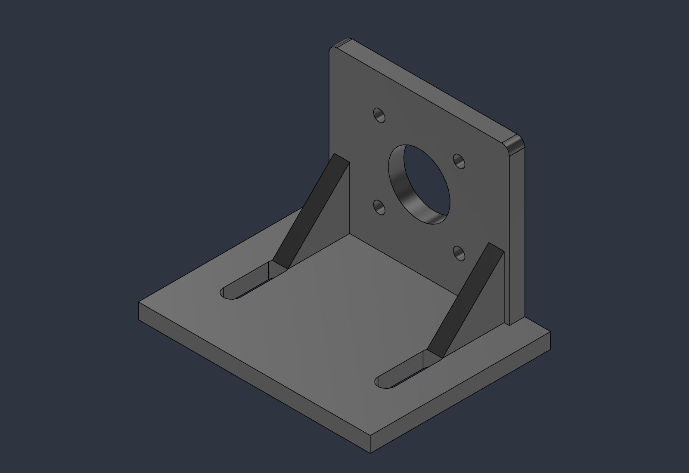
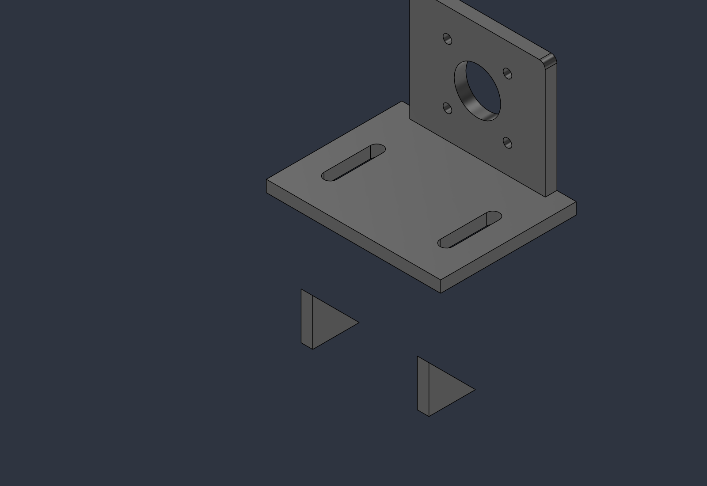
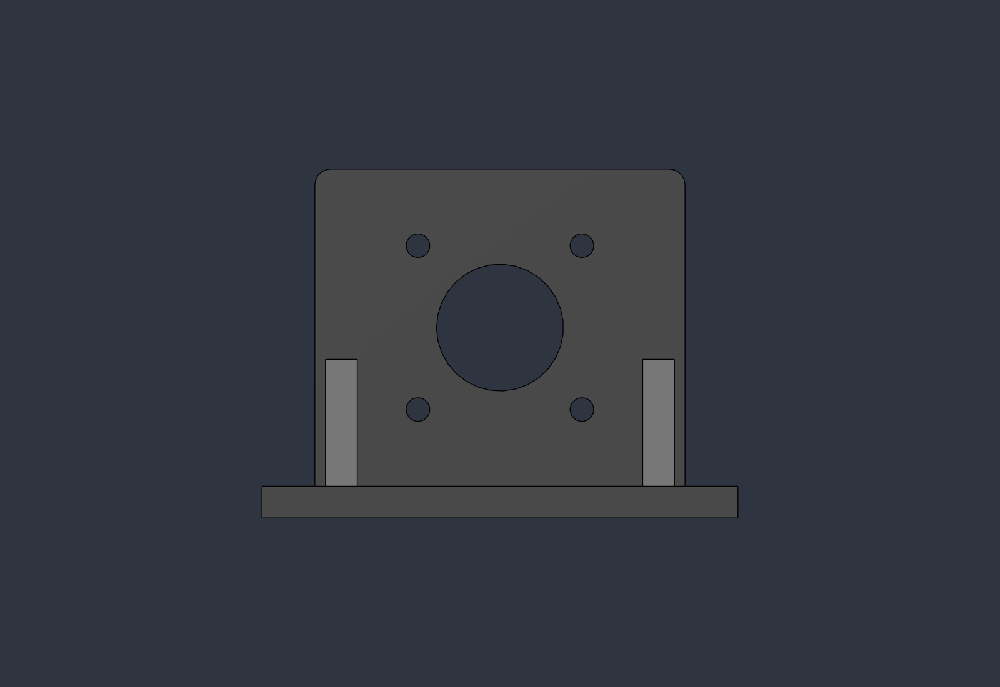
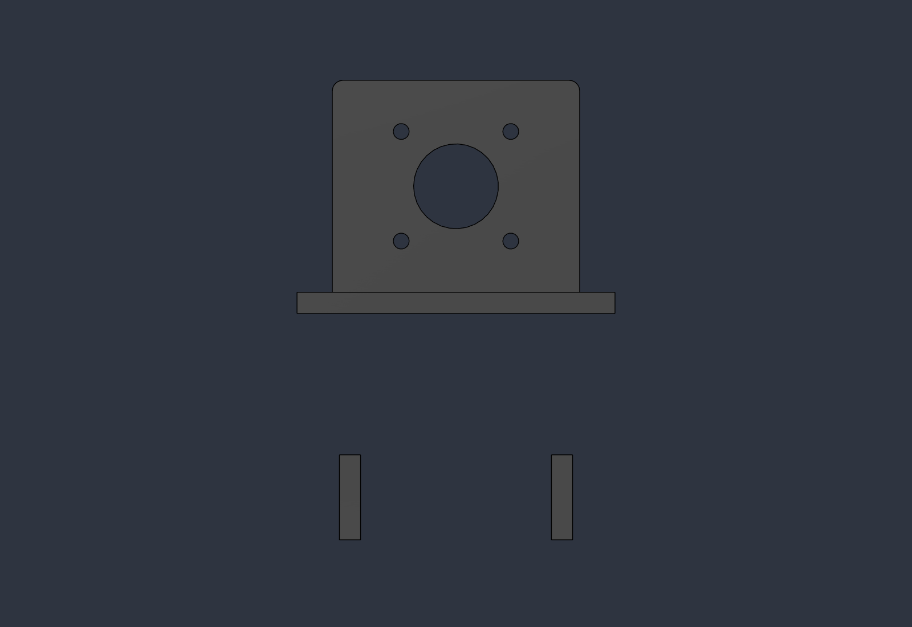
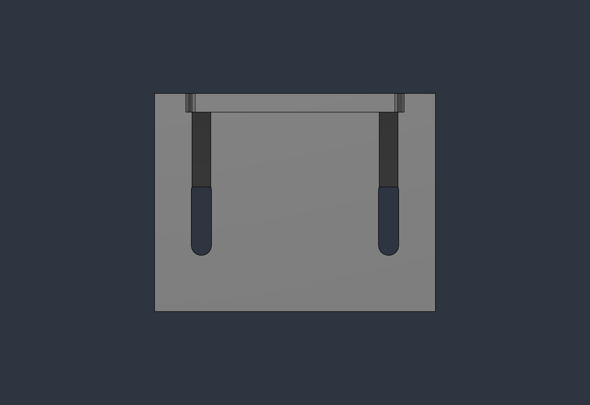
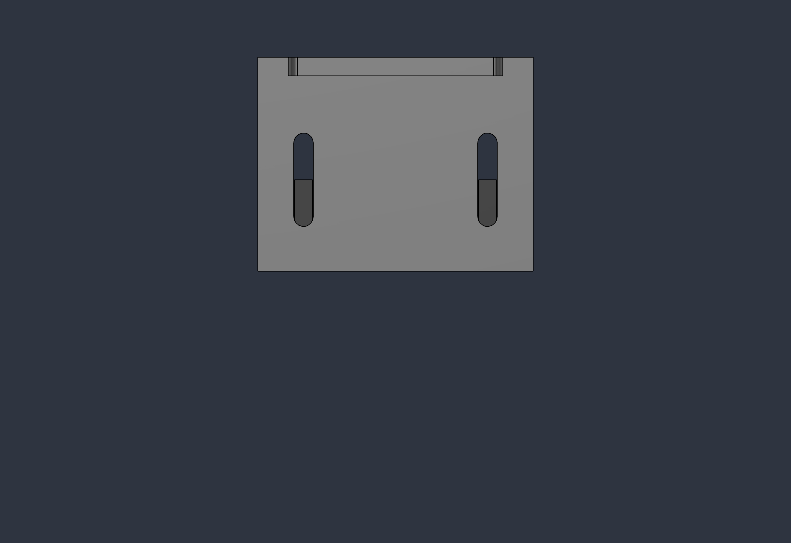
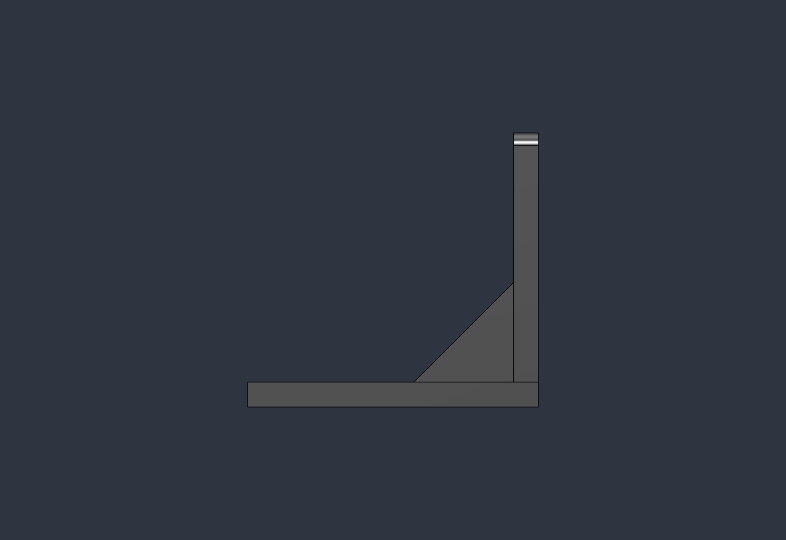
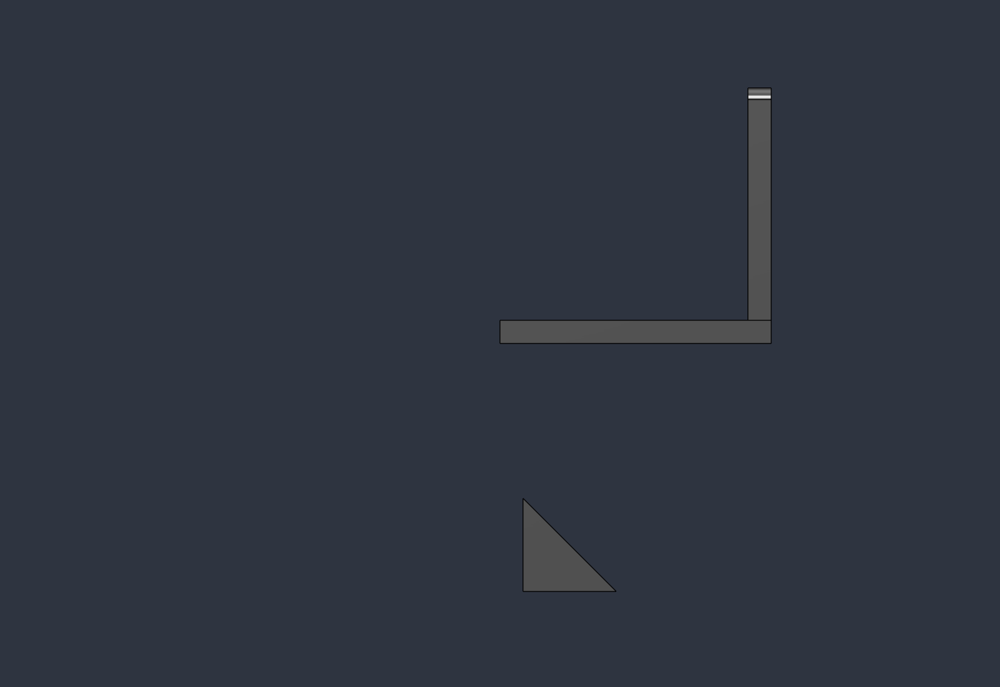

# Benchmark paramétrico Fusion A/B — Claude Desktop vs Codex

## Resumo executivo

Nesta execução, o Claude Desktop com **Fable 5 Alto** venceu de forma inequívoca na qualidade do artefato CAD. Entregou uma peça completa, conectada e paramétrica: 1 corpo, 1 lump, 17 parâmetros, 5/5 sketches totalmente restritos, 7 features saudáveis e envelope exato de 90 × 70 × 66 mm.

O Codex acertou a base, a flange, os cinco furos, os fillets e boa parte da estrutura paramétrica, mas repetiu exatamente o padrão de falha relatado pelo usuário:

- produziu dois gussets desconectados e suspensos abaixo da peça;
- deixou o sketch dos slots sub-restringido;
- interpretou incorretamente o comprimento total dos slots, gerando 30,5 mm em vez de 24 mm;
- recebeu do Fast Path o estado `applied_verified`, embora o resultado tivesse 3 corpos visíveis e 3 lumps.

O achado mais importante não é apenas que o Claude modelou melhor. O benchmark isolou uma combinação de três causas no braço Codex: raciocínio incorreto sobre sistemas de coordenadas locais, interpretação semântica incompleta de uma API geométrica e um oracle de readback que verificou o corpo nomeado, mas não cobriu os requisitos globais da peça.

**Veredito desta execução:**

- Claude — requisitos geométricos e estruturais observáveis do artefato: **PASS**; 9 pontos sobre propriedades paramétricas internas: **não verificáveis sem o script bruto**; protocolo temporal/comunicação: **FAIL**.
- Codex — artefato: **FAIL**; segurança documental: **PASS**; verificação Fast Path: **falso positivo**.
- Pontuação interpretativa pós-auditoria: **Claude ≥78/100, com máximo possível de 87/100; Codex 65/100**.

Este é um estudo exploratório com `n=1`. Ele demonstra uma falha concreta e reproduzível, mas não prova superioridade universal de um modelo.

## Pergunta experimental

O benchmark procurou responder se a diferença percebida entre Claude Desktop e Codex, ao criar peças paramétricas no Fusion, apareceria em uma tarefa suficientemente complexa para exigir:

- planejamento de features;
- domínio de planos e coordenadas locais;
- restrições paramétricas;
- booleans conectados;
- relações de mirror;
- verificação topológica e dimensional.

A comparação é **end-to-end**: modelo, planejamento, integração, transporte e política de verificação. Não é uma comparação isolada de pesos de modelo.

## Protocolo congelado

- Peça: suporte ajustável para motor NEMA 17.
- Ordem: Claude → Codex.
- Limite: 20 minutos por braço.
- Reparos autônomos: no máximo 2 após a tentativa inicial.
- Documento: novo, descartável, não salvo; nenhum documento existente poderia ser alterado.
- Prompt submetido: [`benchmark_prompt.txt`](benchmark_prompt.txt).
- SHA-256 do texto submetido: `8d04113c1ae1da2d03c70fd12bf3eb2b7431ea78d1f1cb08cf56ac3f67b1e1d5`.
- Definição congelada: [`benchmark_definition.json`](benchmark_definition.json).
- Oracle independente: [`oracle_script.py`](oracle_script.py).
- Resultado estruturado: [`results.json`](results.json).

Os critérios geométricos de aceitação e o oracle foram congelados antes da inspeção dos resultados. A ponderação de 100 pontos abaixo foi documentada após a execução; portanto, é uma leitura interpretativa pós-auditoria, não um gate pré-registrado.

O contrato geométrico principal era: base 90 × 70 × 6 mm, flange traseira de 70 × 6 × 60 mm acima da base, furo central Ø24, quatro furos Ø4,5 em quadrado de 31 mm, dois slots 24 × 6,5 mm, dois gussets triangulares conectados e espelhados, e fillets R3 nos cantos superiores da flange.

## Ambiente

| Item | Valor |
|---|---|
| Autodesk Fusion | `2704.1.23` |
| Claude Desktop | Fable 5 Alto |
| Codex | modelo da tarefa atual; identificador exato não exposto |
| Plugin Fusion Agent | `0.2.0+codex.20260713224303` |
| Wheel | `fusion-agent-harness 0.2.0` |
| Fusion MCP | `MCP Server Adapter 1.0.0` |
| Protocolo MCP | `2025-11-25` |
| Manifest fingerprint | `8cca2c5340fb05d8b30e424dbe4edb3ccaa0da739a4c8fcdf232a13a9d3d1096` |

## Resultados lado a lado

| Métrica | Claude | Codex |
|---|---:|---:|
| Corpos sólidos visíveis | **1** | **3** |
| Lumps | **1** | **3** |
| Envelope global | **90 × 70 × 66 mm** | **90 × 70 × 130,06 mm** |
| Z mínimo global | **0 mm** | **−64,06 mm** |
| Parâmetros de usuário | 17/17 | 17/17 |
| Sketches totalmente restritos | **5/5** | **4/5** |
| Sketches visíveis | 0 | 0 |
| Features válidas/saudáveis | 7/7 | 7/7 |
| Comprimento total dos slots | **24 mm** | **30,5 mm** |
| Gussets | conectados e posicionados | desconectados e suspensos |
| Salvou o arquivo | não | não |
| Documento original preservado | sim | sim |

O corpo principal do Codex, isoladamente, mede 90 × 70 × 66 mm. Esse fato explica por que uma inspeção superficial parece boa e por que o verificador parcial passou. O erro só aparece quando se mede o **estado global** do documento e cada corpo individualmente.

## Evidência visual

### Isométrica

| Claude | Codex |
|---|---|
|  |  |

### Frente

| Claude | Codex |
|---|---|
|  |  |

### Topo

| Claude | Codex |
|---|---|
|  |  |

### Direita

| Claude | Codex |
|---|---|
|  |  |

As imagens são evidência secundária. A conclusão foi determinada pelo oracle estruturado, não pela aparência da viewport.

## Auditoria geométrica

### Claude

O oracle confirmou:

- um único corpo sólido válido, visível e com um único lump;
- bbox `min=(-45, 0, 0)` e `max=(45, 70, 66)` mm;
- furo central de raio 12 mm em X=0 e Z=36 mm;
- quatro furos de raio 2,25 mm em X=±15,5 e Z=20,5/51,5 mm;
- slots com centros dos arcos em Y=21,25 e 38,75 mm. A distância entre centros é 17,5 mm; somada ao diâmetro de 6,5 mm, produz exatamente 24 mm totais;
- fillets de raio 3 mm nos dois cantos superiores;
- 17 parâmetros com os valores exatos;
- 5/5 sketches totalmente restritos e ocultos;
- 7/7 features válidas e sem mensagens de erro.

### Codex

O corpo principal contém base, flange, furos e fillets corretos, mas o conjunto falha em requisitos críticos:

1. **Gussets suspensos.** Os dois corpos adicionais têm bboxes:
   - esquerdo: X=−33…−27, Y=5,94…30 e Z=−64,06…−40 mm;
   - direito: X=27…33, Y=5,94…30 e Z=−64,06…−40 mm.

   O esperado era Y≈40…64 e Z≈6…30 mm, conectando base e flange. Os eixos Y/Z foram efetivamente trocados/invertidos no sketch sobre o plano YZ.

2. **Slots longos.** O script passou `SlotLength/2` como meia-extensão da linha central do slot. A API gerou centros de arco em Y=18 e 42 mm, separados por 24 mm. Ao adicionar os dois raios de 3,25 mm, o comprimento total é 30,5 mm. Para o contrato do benchmark, a meia-distância correta entre centros seria `(SlotLength - SlotWidth)/2 = 8,75 mm`.

3. **Sketch sub-restringido.** `SK03_Adjustment_Slots` foi o único dos cinco sketches que permaneceu não totalmente restrito.

4. **Topologia inválida para fabricação.** Há 3 corpos e 3 lumps, portanto a peça não é um sólido único utilizável sem correção manual.

5. **Nome parcial.** O corpo foi nomeado `NEMA17_Adjustable_Bracket`, mas o componente raiz permaneceu `(Não salvo)`.

Os dois planos de construção criados pelo Codex ficaram ocultos, portanto visibilidade de datums não foi um problema nesta execução.

## Fluxo de trabalho observado

### Claude Desktop / Fable 5 Alto

- Prompt enviado em `2026-07-14T01:02:37.375Z`.
- Aproximadamente 11 minutos de planejamento antes da escrita observada.
- Uma chamada mutável `Fusion_mcp_execute`.
- Artefato final estruturalmente excelente, sem necessidade de correção manual.
- Tempo aproximado até a interrupção: 21 min 34 s, ultrapassando o contrato.
- A resposta foi interrompida por limite de mensagem/uso; não houve relato final nem readback independente observável na conversa.

Conclusão do braço Claude: o planejamento foi lento e a integração falhou em concluir o ciclo de comunicação, mas a lógica CAD dentro da única construção foi muito superior.

### Codex / Fusion Agent Fast Path

- A fase ao vivo isolada iniciou no capture do manifest em `2026-07-14T01:24:57.438Z`.
- Resultado final em aproximadamente `2026-07-14T01:44:54Z`: 19 min 57 s.
- O planejamento do script começou enquanto o Claude ainda executava; por isso a latência end-to-end dos dois braços **não é diretamente comparável**.
- Um preflight foi bloqueado antes da escrita porque 30 queries excederam o tamanho de saída tolerado pelo bridge. Reduzir para 13 queries restaurou a identidade estável.
- Tentativa inicial: solver rejeitou uma dimensão sobre-restringida; rollback total comprovado.
- Primeiro reparo: script chegou ao gate final, detectou mais de um corpo e lançou erro; rollback total comprovado.
- Segundo e último reparo: execução concluiu, com 3 corpos e erros geométricos preservados para auditoria.
- Três dispatches mutáveis no total, cada um enviado exatamente uma vez; nenhuma duplicação de mutação.
- A mutação final mais baseline/readback levou 868 ms. O transporte não foi o gargalo.

Conclusão do braço Codex: a infraestrutura foi rápida e segura contra duplicação, mas o fluxo lógico corrigiu sintomas sucessivos sem identificar a causa-raiz do frame local do sketch.

## Falso positivo do Fast Path

O resultado final retornou:

```text
status = applied_verified
verification.passed = true
summary.bodies = 3
summary.visible_body_count = 3
global visible bbox = 90 × 70 × 130,06 mm
```

Isso ocorreu porque as assertions declaradas verificaram:

- existência e bbox do corpo principal nomeado;
- existência/validade das 7 features;
- existência/validade dos 5 sketches.

Os invariantes automáticos apenas exigiram que as contagens não diminuíssem e que a bbox global fosse finita. Eles **não** exigiram:

- exatamente um corpo visível;
- exatamente um lump;
- bbox global igual à especificação;
- todos os sketches totalmente restritos;
- comprimento real dos slots;
- posição e conexão dos gussets.

Portanto, `applied_verified` significou “as assertions parciais passaram”, não “o pedido do usuário foi integralmente satisfeito”. Para uma ferramenta de CAD autônomo, essa distinção precisa estar explícita e ser fail-closed.

Audits:

- [preflight bloqueado](../outputs/fast_path/fast_466b0cd749244c6ca23ca4ac6a0c59ca/audit.json)
- [tentativa inicial](../outputs/fast_path/fast_2ec8fb18f189403684705abe865a11f0/audit.json)
- [primeiro reparo](../outputs/fast_path/fast_55271369a9b24d68a6151c851e29cd81/audit.json)
- [segundo reparo e falso positivo](../outputs/fast_path/fast_e90f63785aa44680b5e776d5bb02e7b4/audit.json)

## Pontuação

| Categoria | Máximo | Claude | Codex |
|---|---:|---:|---:|
| Geometria e envelope | 35 | 35 | 23 |
| Topologia/manufaturabilidade | 10 | 10 | 0 |
| Estrutura paramétrica | 22 | 13 verificados + 9 N/V | 19 |
| Saúde e acabamento | 8 | 8 | 6 |
| **Artefato CAD** | **75** | **≥66 + 9 N/V** | **48** |
| Fluxo autônomo | 10 | 10 | 4 |
| Verificação e comunicação | 7 | 0 | 7 |
| Prazo, robustez e segurança | 8 | 2 | 6 |
| **Processo e integração** | **25** | **12** | **17** |
| **Total** | **100** | **≥78; máximo 87** | **65** |

Notas de pontuação:

- Esta pontuação ponderada é interpretativa e foi organizada após a execução. O resultado primário do benchmark são as medições do oracle, não o número agregado.
- Claude recebe zero em verificação/comunicação porque não houve evidência observável de readback independente nem resposta final. O oracle do avaliador provou geometria, topologia, parâmetros existentes, restrição dos sketches e saúde das features, mas, sem o script bruto, não prova que todas as dimensões dependem dos parâmetros nomeados nem que todas as referências internas são estáveis. Esses 9 pontos ficam **N/V**, sem serem concedidos ou descontados.
- Os 7 pontos de verificação atribuídos ao braço Codex pertencem ao avaliador raiz, que executou o oracle independente após a resposta do Fast Path e antes da alegação final. O verificador Fast Path, isoladamente, recebe zero: seu `applied_verified` foi um falso positivo.
- Codex recebe os pontos de prazo apenas para a fase ao vivo isolada de 19 min 57 s. A latência end-to-end não pode ser comparada, pois parte do planejamento ocorreu em paralelo ao braço Claude.
- Codex perde robustez pelas duas falhas funcionais e pelo falso positivo final, apesar de preservar segurança e não duplicar mutações.

## Causa-raiz técnica

### 1. Transformação de coordenadas improvisada

O script Codex criou `_point`, que projetava coordenadas globais por produto escalar com `sketch.xDirection` e `sketch.yDirection`. A abordagem não tratou corretamente a origem e a orientação efetiva do plano YZ deslocado. O Fusion oferece `Sketch.modelToSketchSpace(Point3D)`, confirmado pela documentação da API ao vivo, justamente para converter um ponto do modelo em um ponto do sketch de forma sensível ao contexto de montagem.

O erro não foi de transporte nem de capacidade bruta de criar features. Foi um erro de raciocínio espacial e de escolha da primitiva de API.

### 2. Semântica incompleta do slot

O parâmetro da API foi tratado como metade do comprimento total externo, mas na geometria produzida ele controlou metade da distância entre os centros dos arcos. Faltou transformar o requisito de domínio “comprimento total incluindo pontas arredondadas” para a expressão da API.

### 3. Oracle derivado da implementação, não do pedido

O contrato Fast Execute verificou os nomes que o próprio script pretendia criar. Não compilou cada requisito do prompt em um invariante independente. Assim, confirmou a intenção do executor, não a correção integral da peça.

### 4. Reparos orientados a sintomas

O primeiro reparo resolveu a sobre-restrição. O segundo tentou forçar overlap para conectar corpos. Nenhum deles inspecionou o frame local do sketch que gerou os gussets. O erro lógico original permaneceu e a tentativa final apenas preservou os corpos no lugar errado.

## Mitigações recomendadas

1. **Sistema de coordenadas tipado.** Proibir helpers manuais de produto escalar em scripts gerados para planos não triviais. Exigir `modelToSketchSpace`/`sketchToModelSpace` ou uma biblioteca interna testada por plano XY/XZ/YZ, offset e assembly context.

2. **Primitivas CAD semânticas.** Expor helpers como `create_slot_overall_length(center, axis, overall_length, width)` que façam internamente a conversão `(L - W)/2`, em vez de pedir ao modelo que memorize a semântica da API de baixo nível.

3. **Compilador de requisitos para oracle.** Cada frase verificável do prompt deve produzir uma assertion independente. O status `applied_verified` só pode existir quando a cobertura obrigatória for 100%; caso contrário, retornar `applied_unverified`.

4. **Assertions globais no Fast Path.** Adicionar suporte a campos de summary e agregações:
   - `summary.bodies == 1`;
   - `summary.visible_body_count == 1`;
   - soma de lumps igual a 1;
   - bbox global aproximada ao envelope esperado;
   - zero surface bodies;
   - zero corpos fora do envelope esperado.

5. **Targeted Inspect mais rico.** Expor `fully_constrained`, `profiles`, `lumps`, `solid/surface`, volume, e assinaturas de faces cilíndricas. Hoje a inspeção rápida não consegue provar vários requisitos fundamentais.

6. **Oracle geométrico independente da nomenclatura.** Verificar centros, raios, eixos, bboxes e conectividade mesmo que os nomes estejam corretos. Nomes saudáveis não garantem geometria correta.

7. **Diagnóstico de reparo por corpo.** Quando `body_count != 1`, fazer readback dos bboxes de todos os corpos antes de planejar o reparo. Um corpo 64 mm abaixo da origem indica frame errado; overlap não é a correção adequada.

8. **Gate visual secundário.** Uma imagem pode detectar rapidamente peças suspensas, mas deve apenas complementar — nunca substituir — a prova programática.

## Limitações

- Amostra única (`n=1`), sem intervalo estatístico.
- Ordem fixa Claude→Codex, sem contrabalanceamento AB/BA.
- Conectores e guardrails diferentes; mede sistemas completos.
- O script bruto do Claude não foi extraído, então a análise de sua estratégia interna é inferida do trace observável e do artefato final.
- A quota/limite de uso do Claude afetou o resultado de produto, mas não isola a capacidade intrínseca do modelo.
- O planejamento Codex começou parcialmente em paralelo ao Claude; somente a fase ao vivo isolada tem relógio utilizável.
- A pontuação foi organizada após a execução, é interpretativa e não constitui uma medida universal de qualidade CAD nem um gate pré-registrado.

## Segurança e limpeza

- O documento Claude foi fechado sem salvar.
- O documento Codex foi fechado sem salvar.
- `main_new v47` foi restaurado como documento ativo, salvo e não modificado.
- A leitura pública final mostrou exatamente um documento aberto: `main_new v47`.
- Nenhum arquivo de benchmark foi gravado no hub do Fusion.

## Conclusão

O benchmark confirma a percepção original do usuário com evidência estrutural: o Codex consegue construir partes plausíveis e até uma timeline aparentemente saudável, mas falha no encadeamento espacial e semântico que transforma features isoladas em uma peça paramétrica utilizável. O Claude, nesta tarefa, demonstrou um planejamento geométrico muito mais coerente.

Ao mesmo tempo, o teste mostrou que melhorar apenas o modelo não basta. O harness precisa impedir que uma verificação parcial seja promovida a `applied_verified`. A prioridade técnica mais alta é combinar primitivas geométricas de alto nível, frames tipados e um oracle compilado diretamente dos requisitos do usuário.
