# Relatório técnico da suite paramétrica B02–B07

> **Registro histórico invalidado para 0.4.1.** Os resultados raw citados neste
> relatório foram removidos porque não eram vinculados à revisão e à identidade
> exata da fixture e expunham identificadores privados. Eles não são evidência de
> release nem resultado scoreable. A revalidação 0.4.1 grava somente projeções
> públicas em `outputs/reference-runs/<run_id>/` e exige provenance completa,
> oracle document-bound e comparator elegível.

Data: 14 de julho de 2026
Run canônico completo B02–B07: `ref_20260714T055207Z`
Conclusão UTC: `2026-07-14T05:52:57Z`

## Resumo executivo

Os seis casos B02–B07 terminaram em `completed_pass`. B05–B07 aprovaram tanto a construção initial quanto a ECO no mesmo documento, sempre com Fast Path `applied_verified`, oracle independente, screenshots direcionais e teardown comprovado.

As referências aprovadas comprovam somente que suas fixtures, oracles e protocolo seguro são executáveis. Este relatório não compara Claude e Codex e não permite inferir desempenho relativo entre modelos. Diretório criado, script concluído ou `applied_verified` isolado nunca são tratados como aprovação.

| Caso | Tempo | Oracle | Falhos | Não verificados | Mutação/dispatch | Cleanup |
|---|---:|---:|---:|---:|---:|---|
| B02 | 4.536 ms | 13/13 | 0 | 0 | 1/1 | fechado sem salvar; restaurado |
| B03 | 4.215 ms | 15/15 | 0 | 0 | 1/1 | fechado sem salvar; restaurado |
| B04 | 4.663 ms | 17/17 | 0 | 0 | 1/1 | fechado sem salvar; restaurado |
| B05 initial | 8.024 ms total | 11/11 | 0 | 0 | uma fase | fechado após ECO; restaurado |
| B05 ECO | — | 8/8 | 0 | 0 | uma fase | fechado sem salvar; restaurado |
| B06 initial | 9.127 ms total | 8/8 | 0 | 0 | uma fase | fechado após ECO; restaurado |
| B06 ECO | — | 7/7 | 0 | 0 | uma fase | fechado sem salvar; restaurado |
| B07 initial | 17.869 ms total | 13/13 | 0 | 0 | uma fase | fechado após ECO; restaurado |
| B07 ECO | — | 10/10 | 0 | 0 | uma fase | fechado sem salvar; restaurado |

No agregado canônico, `restored=true`: o ID do documento ativo final coincide com o original e os oito IDs de documentos abertos ao final são idênticos, na mesma ordem, aos oito IDs iniciais. `reference_suite_result.json` agrega B02–B07; cada caso também preserva seu resultado detalhado.

Cada fase preservou quatro PNGs distintos por direção — isométrica, frontal, superior e direita. O gate exige as quatro direções e rejeita um conjunto que resulte no mesmo hash para todas as vistas; screenshots continuam sendo evidência secundária, nunca substituto do oracle programático.

## B02 — Parametric vented electronics enclosure

### Contrato e riscos

B02 exige um único sólido/lump de 120 × 80 × 35 mm, cavidade superior aberta, piso de 3 mm, paredes de 2,4 mm, quatro bosses ocos e trinta slots laterais em duas grades 5×3. Os principais riscos são topologia tampada, bosses flutuantes, off-by-one de padrão, seed duplicado, mirror incorreto e confusão entre distância dos centros e comprimento total do slot.

### Evidência real

Fonte histórica removida: `cases/b02_vented_enclosure/reference_result.json`.

- Fast Path: `applied_verified`.
- Oracle: `b02_vented_enclosure_geometry`.
- Cobertura: 13 obrigatórios, 13 pass, 0 fail, 0 unverified.
- Tempo: 4.536 ms.
- Uma mutação; um dispatch mutável.
- Quatro screenshots PNG.
- Documento fechado sem salvar; documento e inventário originais restaurados.

Os checks incluíram marker/não salvo, body count, sólido/lump, parâmetros, sketches, saúde, bbox, cavidade/paredes/piso, bosses e assinatura geométrica/padrão dos vents.

| Isométrica | Frontal |
|---|---|
| 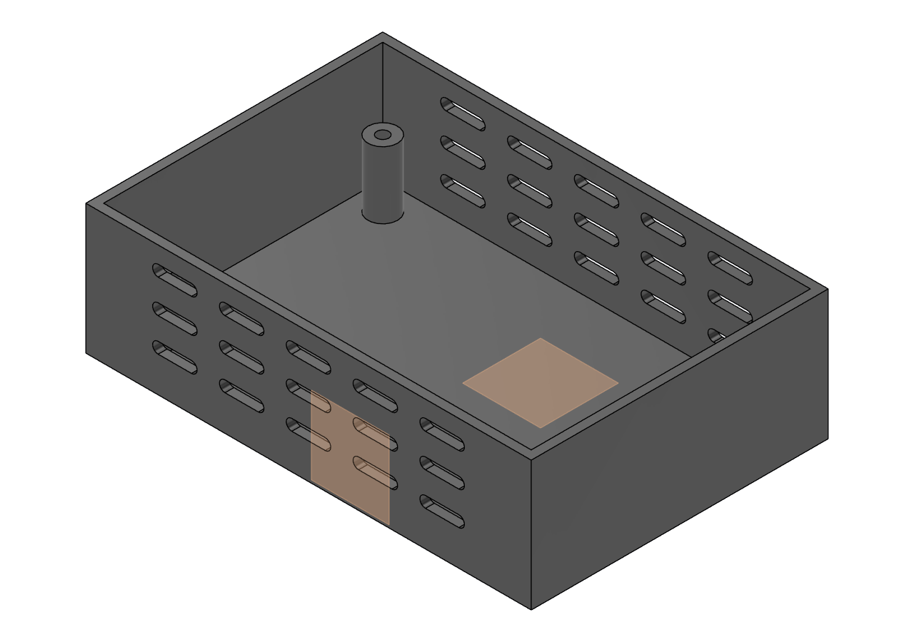 | 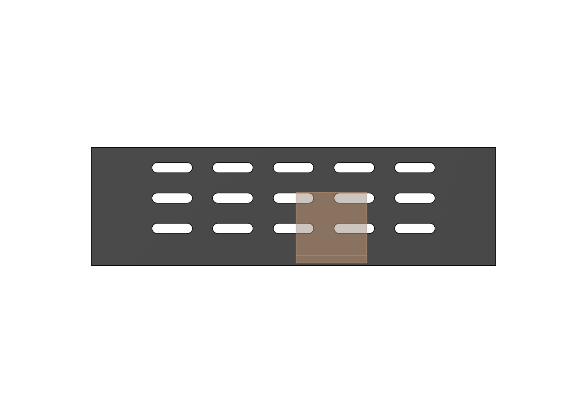 |

## B03 — Parametric split pillow block with separate cap

### Contrato e riscos

B03 usa `CMP01_Lower_Block` e `CMP02_Upper_Cap`, cada qual com um sólido/lump. O conjunto nominal mede 90 × 50 × 44 mm, tem gap de 0,5 mm em Z=22 mm, bore Ø24 no eixo X, quatro furos de aperto alinhados por componente, quatro counterbores somente na tampa e dois furos de montagem somente na base.

Os riscos cobertos incluem assembly context incorreto, body no root, gap errado, bore não coaxial, furos desalinhados, cortes no componente errado e tool bodies residuais.

### Evidência real

Fonte histórica removida: `cases/b03_split_pillow_block/reference_result.json`.

- Fast Path: `applied_verified`.
- Oracle: `b03_split_pillow_block_geometry`.
- Cobertura: 15 obrigatórios, 15 pass, 0 fail, 0 unverified.
- Tempo: 4.215 ms.
- Uma mutação; um dispatch mutável.
- Duas ocorrências com transform identidade e root sem bodies.
- Bore inferior e superior coaxiais em `(Y=0, Z=22)` mm, raio 12 mm e eixo X.
- Quatro screenshots PNG; teardown integral.

### Aprendizados de implementação

1. **Sobre-restrição por quadrante.** A tentativa de dimensionar separadamente os centros dos quatro furos produziu `VCS_SKETCH_OVER_CONSTRAINTS`. O script final usa um único seed e `RectangularPatternFeature` para 2×2, evitando equações redundantes e tornando a cardinalidade auditável.
2. **Frame YZ.** Pontos globais não podem ser tratados como coordenadas 2D nativas do sketch. O script final usa `modelToSketchSpace` nos perfis YZ, corrigindo orientação e altura do split/bore.
3. **Nome de occurrence.** A atribuição direta a `Occurrence.name` falhou com propriedade sem setter. Nomear o componente gerou corretamente `CMP01_Lower_Block:1` e `CMP02_Upper_Cap:1`.

| Isométrica | Frontal |
|---|---|
| 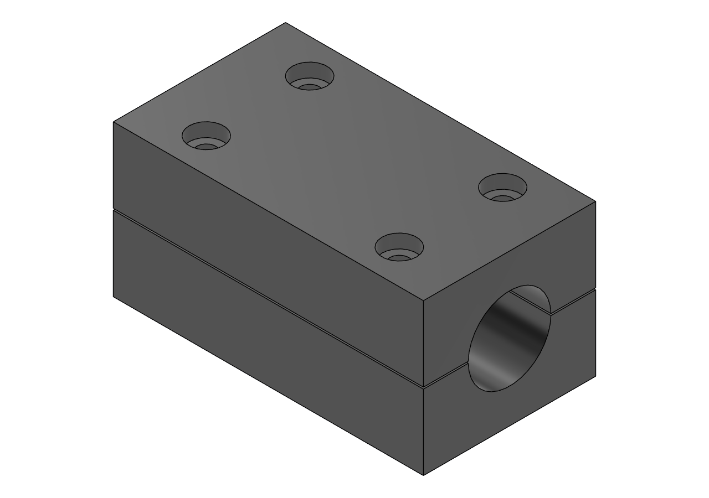 |  |

## B04 — Offset rectangular-to-circular hollow duct adapter

### Contrato e riscos

B04 exige um único body/lump no root, flange inferior 100 × 70 × 5 mm, entrada 80 × 50 mm, parede de 3 mm, loft externo e passagem interna loftada. A saída ID54/OD60 tem offset `(14, 8)` mm e flange Ø82 × 5 mm. Há quatro furos inferiores em 2×2 e seis superiores em bolt circle de 72 mm ao redor do eixo offset.

Os riscos são frames deslocados, seções de loft trocadas, passagem bloqueada, parede inconsistente, tool body não consumido, eixo do padrão circular na origem e bodies/lumps extras.

### Evidência real

Fonte histórica removida: `cases/b04_offset_duct_adapter/reference_result.json`.

- Fast Path: `applied_verified`.
- Oracle: `b04_offset_duct_adapter_geometry`.
- Cobertura: 17 obrigatórios, 17 pass, 0 fail, 0 unverified.
- Tempo: 4.663 ms.
- Uma mutação; um dispatch mutável.
- Um body sólido, visível e com um lump.
- Bbox observada: 105 × 84 × 100 mm.
- Passagem aberta nos probes de entrada, transição e saída.
- Saída coaxial em `(X=14, Y=8)` mm; padrões 2×2 e 6× aprovados.
- Quatro screenshots PNG; teardown integral.

### Aprendizados e limitação de acabamento

- A API desta instalação não expõe `ConstructionAxisInput.setByCylinderOrConeFace`; o método funcional é `setByCircularFace`. O contrato/API references e o script final foram ajustados antes do run canônico.
- Quatro sketches de loft ficaram visíveis: `SK02_Outer_Lower_86x56`, `SK03_Outer_Outlet_OD60`, `SK05_Inner_Inlet_80x50` e `SK06_Inner_Outlet_ID54`.
- `CA01_Offset_Outlet_Axis` também permaneceu visível.
- O Fast Path bloqueia mudanças explícitas de visibilidade. Por isso B04 é um **pass geométrico e paramétrico com limitação de acabamento registrada**, não uma alegação de acabamento visual perfeito.

O oracle mediu oito sketches válidos e totalmente restritos, quatro deles visíveis. A visibilidade não invalidou os 17 gates geométricos congelados, mas deve permanecer visível no relatório para orientar evolução do harness.

| Isométrica | Frontal |
|---|---|
| 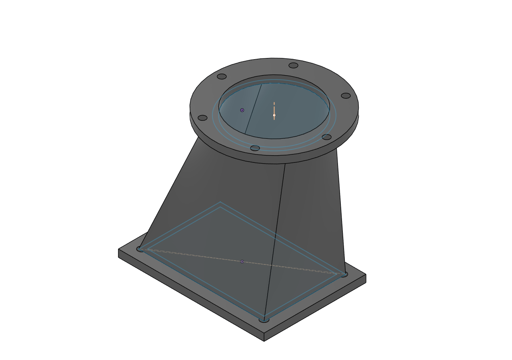 | 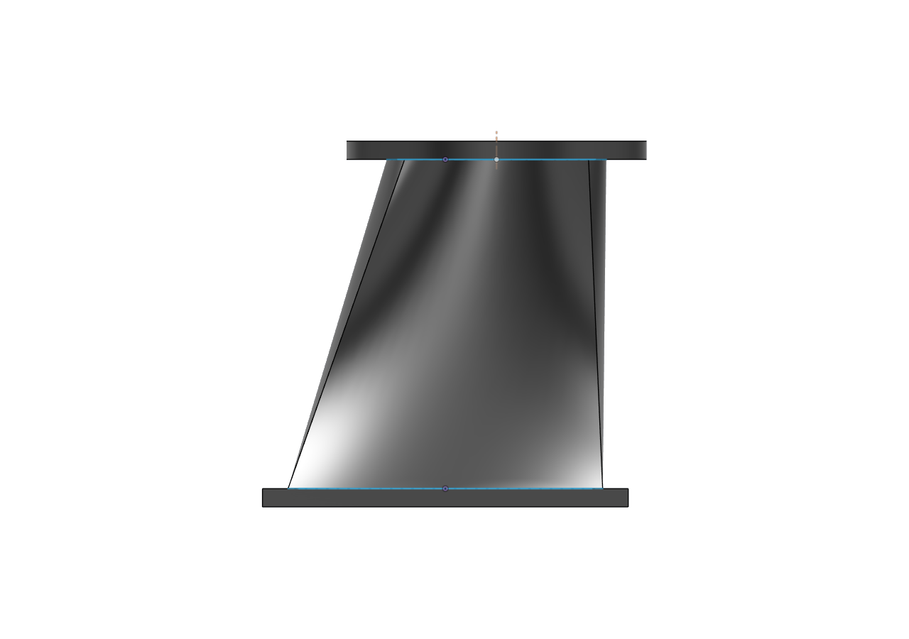 |

## Casos compostos initial + ECO

B05–B07 medem intenção paramétrica em duas fases. O modelo recebe primeiro somente o contrato initial. Após snapshot/oracle, uma ECO altera parâmetros no mesmo documento e um segundo oracle mede tanto o novo estado quanto invariantes de identidade, cardinalidade, conectividade e saúde. Cada fase mutável tem operation ID próprio e nunca é repetida após dispatch incerto.

O critério de aprovação composto é conjuntivo: oracle initial aprovado, ECO aplicada, oracle ECO aprovado, quatro PNGs válidos por fase, close sem salvar e restauração integral. Um caso que falhe na primeira fase pode continuar apenas para produzir diagnóstico; ele não pode ser promovido por passar assertions locais na ECO.

## B05 — Parametric spherical lattice radome

### Contrato e dificuldade

B05 é uma adaptação clean-room do desafio de isogrid sobre superfície curva da PTC. A fixture inicial contém casca esférica oca de raio 90 mm e espessura 3 mm, flange OD200 × 6 mm, doze ribs meridionais, cinco rings de latitude, bolt circle de 184 mm e doze furos Ø6,5 mm. O contrato exige um body/lump conectado, 28 parâmetros, 13 features e dez sketches.

A dificuldade não é apenas produzir uma silhueta hemisférica. O oracle distingue cavidade aberta, shell real, flange anular, cardinalidade dos patterns e relações trigonométricas dos rings. Geometria decorativa desconectada, um dome maciço ou cardinalidade visualmente aproximada reprovam.

### ECO e evidência real

A ECO `eco_b05_scale_and_repattern` altera:

- `DomeRadius`: 90 → 105 mm;
- `BaseFlangeOD`: 200 → 230 mm;
- `BaseBoltCircleDiameter`: 184 → 210 mm;
- `BaseBoltCount`: 12 → 16;
- `MeridianCount`: 12 → 16.

Fonte histórica removida: `cases/b05_spherical_lattice_radome/reference_result.json`, run `ref_20260714T055207Z`.

- Initial: `applied_verified`; oracle `b05_spherical_lattice_radome_geometry`; 11/11 pass.
- ECO: `applied_verified`; oracle `b05_spherical_lattice_radome_eco`; 8/8 pass.
- Tempo total: 8.024 ms.
- O bbox passou de 200 × 200 × 96 para 230 × 230 × 111 mm.
- Quatro screenshots initial e quatro ECO foram preservados.
- O documento foi fechado sem salvar; documento ativo e inventário foram restaurados.

| Initial | ECO |
|---|---|
| 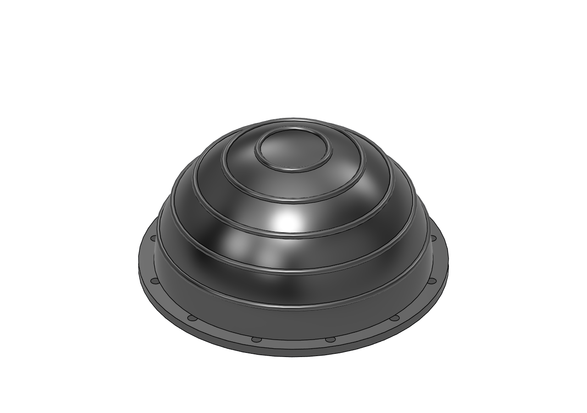 | 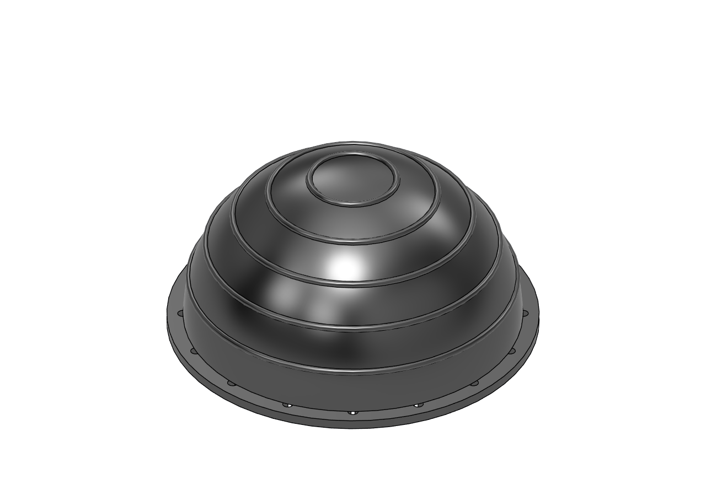 |

Status: `completed_pass` nas duas fases.

## B06 — Parametric multi-component industrial robot arm

### Contrato e dificuldade

B06 contém 16 componentes/occurrences em transform identidade, 16 bodies, 36 parâmetros e doze joints as-built, quatro deles revolute. A cadeia nominal inclui base, pedestal, shoulder motor, upper arm, elbow motor, forearm, wrist pitch/roll, flange, palm, dois fingers e três segmentos de cable harness.

O oracle não aceita a mera presença das peças. Ele verifica root sem bodies, identidade das transforms, bbox individual, eixo/saúde dos joints, continuidade espacial shoulder→tool e propagação dos cables. Esse desenho mira diretamente falhas de frame local/global e geometrias suspensas que podem parecer plausíveis em uma única vista.

A ECO `eco_b06_extend_kinematic_chain` altera:

- `UpperArmLength`: 160 → 195 mm;
- `ForearmLength`: 130 → 155 mm;
- `WristLength`: 70 → 85 mm;
- tool tip esperado: `(X=400, Z=290)` → `(X=450, Z=315)` mm.

### Evidência canônica aprovada

Fonte histórica removida: `cases/b06_robot_arm_assembly/reference_result.json`.

- Run: `ref_20260714T055207Z`.
- Initial: Fast Path `applied_verified`; oracle `b06_robot_arm_assembly_geometry` 8/8.
- ECO: Fast Path `applied_verified`; oracle `b06_robot_arm_assembly_eco` 7/7.
- Tempo total: 9.127 ms.
- A correção de frame do wrist-roll motor e do tool flange restaurou bbox e continuidade da cadeia.
- O documento foi fechado sem salvar; documento ativo e inventário de oito IDs foram restaurados.

| Initial — oracle aprovado | ECO — oracle aprovado |
|---|---|
| 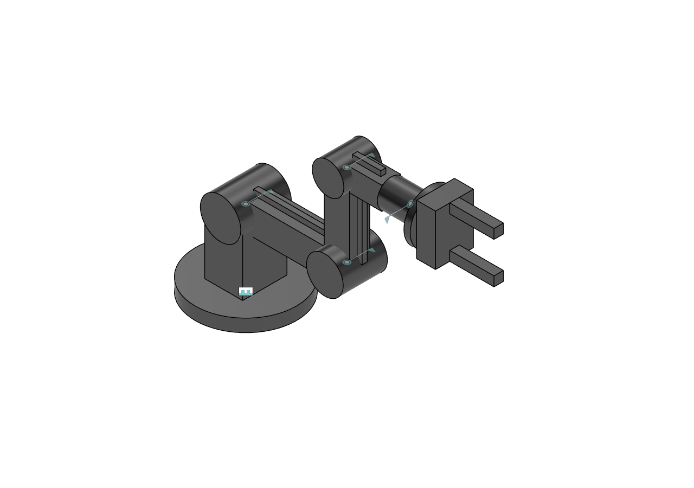 | 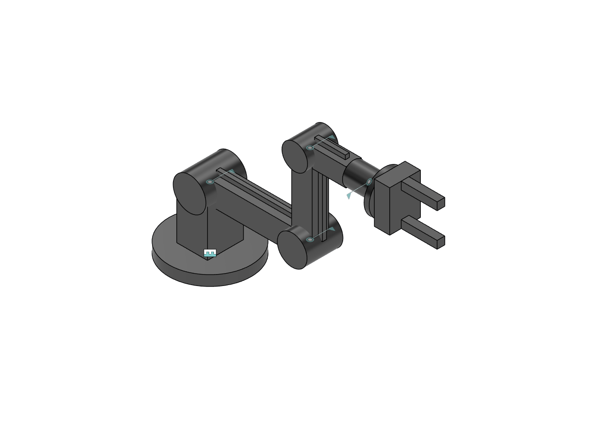 |

Status: `completed_pass`. Uma tentativa diagnóstica anterior mostrou que correção geométrica não substitui o gate operacional de teardown; a promoção ocorre somente porque o run canônico também comprovou cleanup e restauração.

## B07 — Parametric multi-component industrial packaging machine

### Contrato e dificuldade

B07 contém 59 parâmetros, 34 componentes/occurrences em transform identidade, 34 bodies, 34 features, 35 sketches nos componentes e o sketch root de referência `SK00_Machine_Envelope`. A árvore mecânica possui 33 joints as-built, cinco revolute. A máquina inclui frame, painéis e porta articulada, conveyor, quatro rollers, motor, hopper/throat, suportes e cabinet.

O envelope initial aprovado é 600 × 620 × 500 mm, com mínimo `(-300, -310, 0)` e máximo `(300, 310, 500)` mm. O oracle verifica documento descartável, parâmetros, hierarquia/identidade, um body saudável por componente, frame fechado, porta/hinges, tangência belt–rollers, cadeia hopper→throat→belt, cabinet ancorado, suportes, interferências críticas e joint graph conectado.

A ECO `eco_b07_widen_packaging_cell` altera:

- `MachineWidth`: 600 → 760 mm;
- `BeltWidth`: 300 → 400 mm;
- `DoorWidth`: 360 → 460 mm.

Frame, painéis, porta, conveyor, rollers, motor e hopper propagam a mudança; o envelope final alcança X=±380 mm.

Fonte histórica removida: `cases/b07_packaging_machine/reference_result.json`, run `ref_20260714T055207Z`.

- Initial: Fast Path `applied_verified`; oracle `b07_packaging_machine_geometry` 13/13.
- ECO: Fast Path `applied_verified`; oracle `b07_packaging_machine_eco` 10/10.
- Tempo total: 17.869 ms.
- Quatro screenshots initial e quatro ECO, com direções e hashes preservados.
- Documento fechado sem salvar; documento ativo e inventário restaurados.

Limitação honesta: o motor e o roller de saída são coaxiais e reservam um gap axial de 20 mm para a interface, mas o acoplamento físico eixo/rolamento não foi modelado. O pass não reivindica bearings, eixo ou acoplamento prontos para fabricação. Sheet-metal flat patterns, cut list e BOM também permanecem fora do escopo.

| Initial | ECO |
|---|---|
| 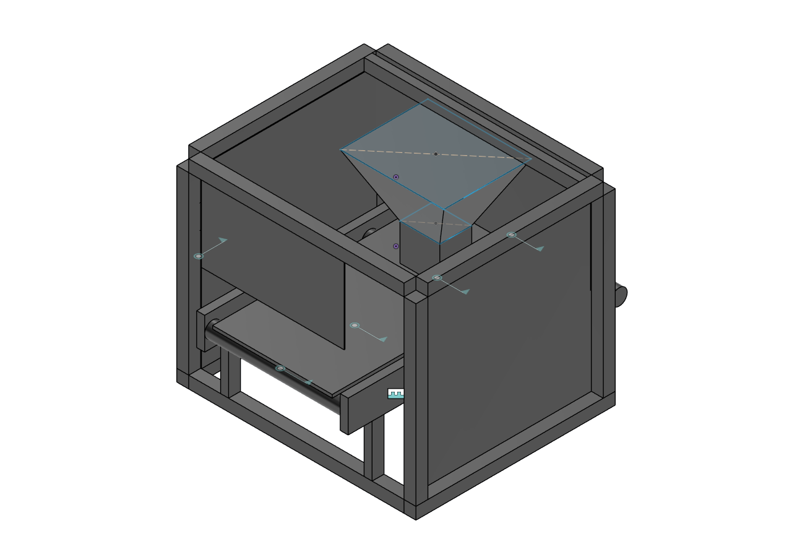 | 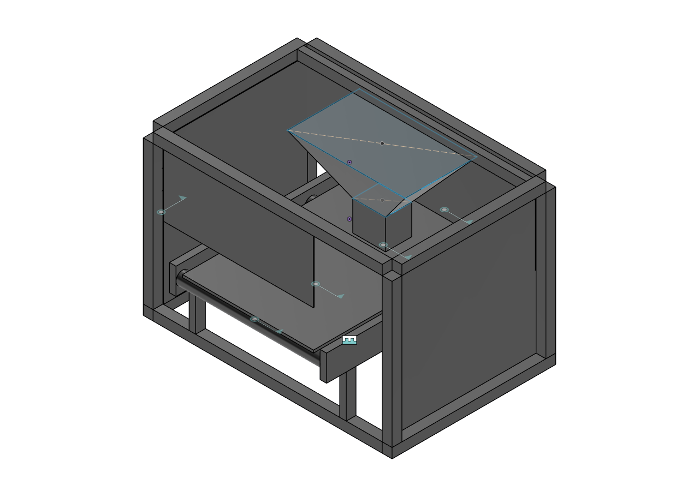 |

Status: `completed_pass` nas duas fases.

## Comportamento do executor persistente

O executor nativo do Fusion acumula wrappers de `stdout`/`stderr` no interpretador persistente e pode entrar em `RecursionError` depois de muitas chamadas. A causa observada, a diferença entre sessão e processo, o reset validado, a mitigação proposta e os testes soak estão registrados em [`EXECUTOR_RELIABILITY.md`](EXECUTOR_RELIABILITY.md).

Esse fato é operacionalmente distinto dos resultados finais:

- nenhuma mutação final foi repetida;
- B02–B04 registram uma mutação e um dispatch por trial; B05–B07 usam uma operação initial e outra ECO, cada qual enviada uma única vez;
- o run canônico completo passou, mas não há alegação de que a Autodesk corrigiu o wrapper upstream.

Esse defeito pertence ao processo Python do Fusion: trocar apenas `sessionId` não o remove. Uma mutação afetada depois do dispatch deve permanecer `MUTATION_OUTCOME_UNKNOWN`, sem replay, até que um oracle independente prove o pós-estado.

## Protocolo e conclusão

Cada caso usou documento novo, não salvo e marcado; baseline vazio; no máximo um dispatch por fase; oracle independente; quatro screenshots direcionais por fase; close sem salvar; restauração do documento e inventário originais. O gate exige as quatro direções e rejeita quatro capturas com o mesmo hash. Screenshots foram evidência secundária.

Resultado: B02–B07 estão integralmente aprovados em `ref_20260714T055207Z`; B05–B07 também aprovaram suas ECOs. A visibilidade residual de B04, o acoplamento eixo/rolamento não modelado em B07 e a confiabilidade ainda dependente do executor Autodesk permanecem limitações explícitas, não escondidas pelo Fast Path.

As origens clean-room e o posicionamento de dificuldade estão em [`COMPETITION_SOURCES.md`](COMPETITION_SOURCES.md). A aprovação desta referência comprova os contratos e oracles da suite; não transforma B07 em projeto de fabricação completo nem constitui benchmark A/B entre modelos.
